Overview
========

The Eclipse Callgraph plug-in provides a visual function trace of a
program. This allows you to view a visualization of selected (or even
all) functions used by the profiled application.

This plug-in allows you to profile C/C++ projects directly within the
Eclipse IDE, providing various runtime details such as:

-   The relationship between function calls
-   Number of times each function was called
-   Time taken by each instance of a function (relative to the program's
    execution time)
-   Time taken by all instances of a function (relative to program's
    execution time)

Eclipse Callgraph uses SystemTap to perform function traces. For more
information about SystemTap, refer to the [SystemTap Beginner's
Guide](http://sources.redhat.com/systemtap/SystemTap_Beginners_Guide/).

Installation
============

Performing visual function traces with Eclipse Callgraph requires three
components:

-   the Eclipse Callgraph plugins
-   SystemTap
-   the kernel information packages required by SystemTap

On Fedora, you can install all of these items through **yum**. To
install SystemTap, run:

    yum -y install systemtap systemtap-runtime

The required kernel information packages are the matching **-devel**,
**-debuginfo**, and **-debuginfo-common** packages of the kernel you
wish to profile. You can use **yum** or **debuginfo-install** to install
these packages. It is advised that you add your user-id to both the
**stapdev** and **stapusr** groups. If you see error messages regarding
**avahi** or if you get a message saying: "Unable to find server", this
is due to your user-id not being part of the **stapdev** group. When
adding your user-id to these special groups, you will need to logout and
login again for the changes to take effect.

For more details about installing SystemTap, refer to [Installation and
Setup](http://sources.redhat.com/systemtap/SystemTap_Beginners_Guide/using-systemtap.html#using-setup)
from the [SystemTap Beginner's
Guide](http://sources.redhat.com/systemtap/SystemTap_Beginners_Guide/).

General Usage
=============

All the profiling plugins (including Eclipse Callgraph) are accessible
from the C/C++ perspective. There are two ways to start using Eclipse
Callgraph via the **Profiling Tools** project menu:

Using **Profiling Tools -> Function callgraph**

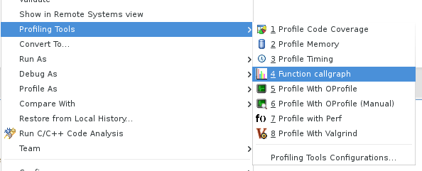

or using **Profiling Tools -> Profile Timing** and setting the timing
tool to be Callgraph.

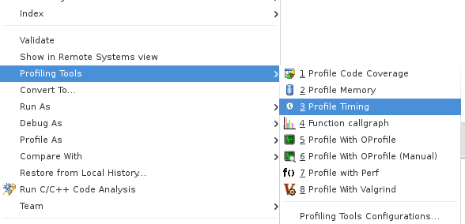

To properly set the preferences you can go to
**C/C++ -> Profiling -> Categories -> Timing** and set the default timing
tool to be Callgraph.

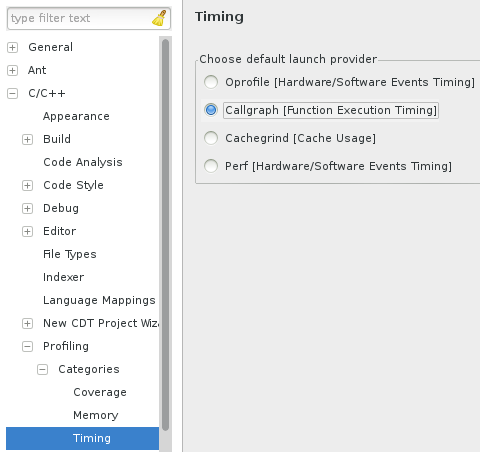

Alternatively, you can set project specific preferences which override
workspace preferences by using project **Properties -> C/C++
General -> Profiling Categories -> Timing**.

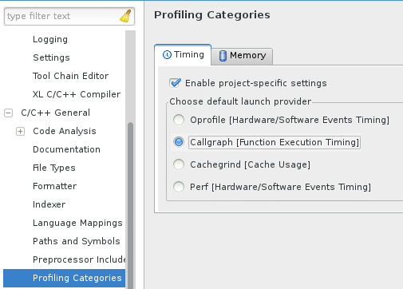

You can also profile your application using Profile as... -> Local C/C++
Application whereby you have set the profiling tool in the Profiler tab
to be Callgraph.

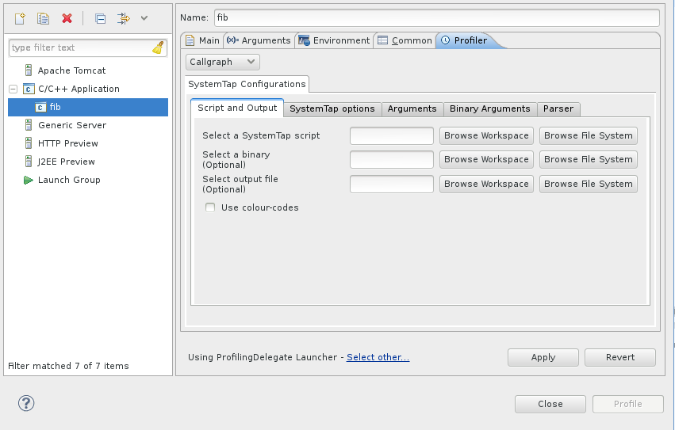

This will open a dialog from which you can select an executable to
profile.

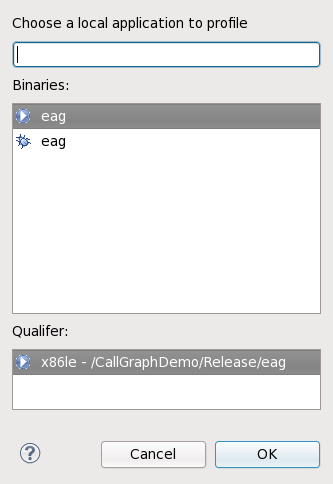

After selecting an executable to profile, Eclipse Callgraph will ask
which files to probe. By default, all source files in the project will
be selected.

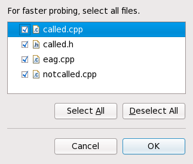

Callgraph Perspectives
======================

The **Callgraph** view's toolbar allows you to select a perspective and
perform other functions.

Radial View
-----------

The **Radial View** displays all functions branching out from
**main()**, with each function represented as a node. A purple node
means that the program terminates at the function. A green node
signifies that the function call has nested functions, whereas gray
nodes signify otherwise. Double-clicking on a node will show its parent
(colored pink) and children. The lines connecting different nodes also
display how many times **main()** called each function.

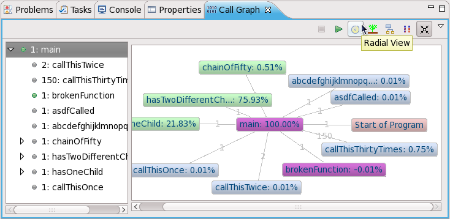

The left window of the **Radial View** lists all of the functions shown
in the view. This window also allows you to view nested functions, if
any. A green bullet point means the program either starts or terminates
at that function.

Tree View
---------

The **Tree View** is similar to the **Radial View**, except that it only
displays all descendants of a selected node (**Radial View** only
displays functions one call depth away from a selected node). The top
left of **Tree View** also includes a thumbnail viewer to help you
navigate through different call depths of the function tree.

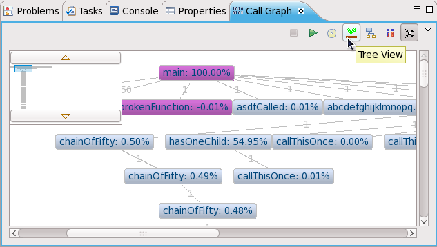

Level View
----------

**Level View** displays all function calls and any nested function calls
branching out from a selected node. However, **Level View** groups all
functions of the same call depth together, giving a clearer
visualization of a program's function call execution sequences.

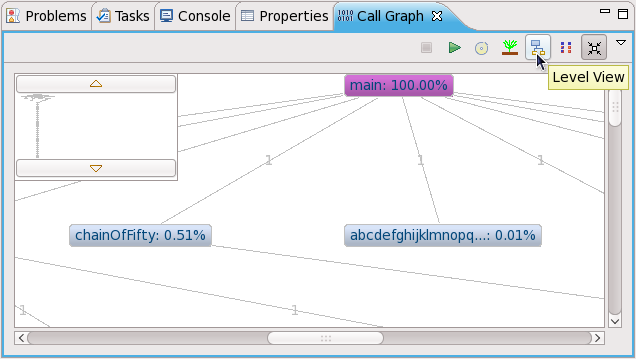

**Level View** also lets you navigate through different call depths
using the thumbnail viewer's **More nodes above** and **More nodes
below** buttons.

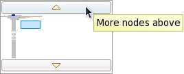

Aggregate View
--------------

The **Aggregate View** depicts all functions as boxes; the size of each
box represents a function's execution time relative to the total running
time of the program. Darker-colored boxes represent functions that are
called more times relative to others; for example, in the following
figure, the **CallThisThirtyTimes** function is called the most number
of times (150).

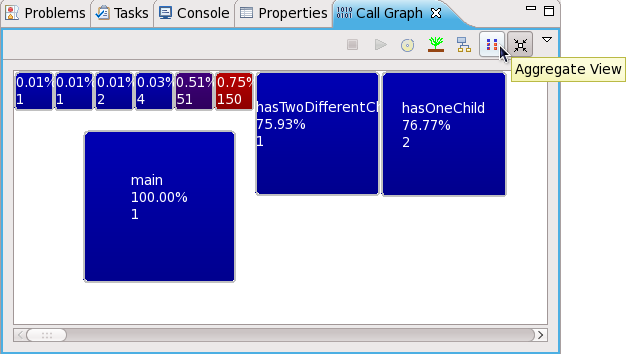

General Usage
=============

Most of Eclipse Callgraph's general functions are available through the
**Callgraph** view's toolbar and **View Menu**.

Collapse Mode
-------------

The **Callgraph** view's toolbar also features a **Collapse Mode**
button. This button groups all identical functions (i.e. those with
identical names and call histories) together into one node. Doing so can
be helpful in reducing screen clutter for programs where many functions
get called multiple times.

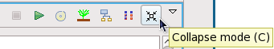

Watching function calls in chronological order
----------------------------------------------

To play a visual representation of a function trace, click the **View
Menu** button then navigate to **Goto**. This menu will allow you to
pause, step through, or mark each function as it executes.

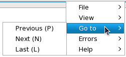

Code link
---------

The graph views are linked to the source code as well. To navigate to
where a function is called in the code, hold **Ctrl** while
double-clicking on a function's node (in any view except **Aggregate
View**). Doing so will open the corresponding source file in the Eclipse
editor and highlight the function call.

To navigate to a function's definition in the source, hold **Ctrl**
while double-clicking on a function's node in the **Aggregate View**.
Doing so will open the corresponding source file in the Eclipse editor
and highlight the function definition.

Save/load profile runs
----------------------

Large projects may take longer to render; as such, Eclipse Callgraph
allows you to save the data collected from a profile run. Loading the
data file and attempting to render it will take a much shorter time than
attempting to go through the full process of profiling a project.

To save or load data from a profile run, navigate to **File** (under the
**View Menu**); this will display different options relating to saving
and loading profile runs.

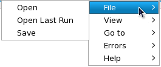

