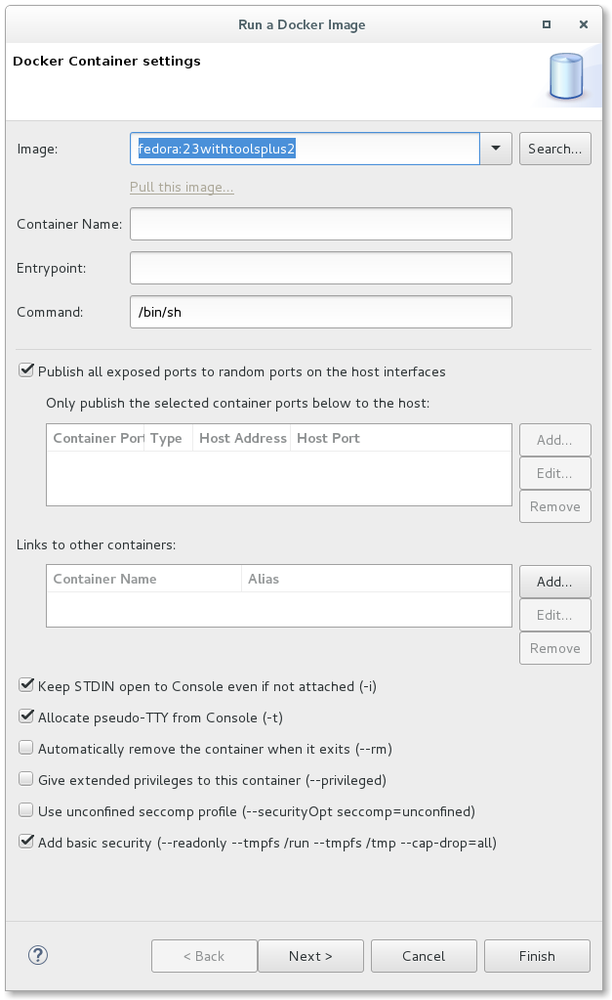

Introduction
============

The Linux Tools Docker Tooling plug-ins allow a user to manage Docker Images and Containers with functionality similar to the command-line docker command.

For details on Docker and the docker command, see the Docker web-site at <http://www.docker.com>

This document discusses functionality found in the Docker Tooling 3.1.0 feature.

Docker Tooling Perspective
==========================

A new perspective known as the Docker Tooling Perspective is added.

This perspective brings up three new views added:

-   [Docker Explorer View](#Docker_Explorer_View "wikilink") - view for creating/managing connections to Docker daemons
-   [Docker Images View](#Docker_Images_View "wikilink") - view for managing Docker Images
-   [Docker Containers View](#Docker_Containers_View "wikilink") - view for managing Docker Containers

In addition, the Docker Tooling Perspective adds the [Docker Image Hierarchy View](#Docker_Image_Hierarchy_View "wikilink"), Console View, the Terminal View, and the Properties View.

The Console View is used to display logs of stdout/stderr output from Containers and in some instances, allow input to stdin. The Properties View allows clicking on various elements such as Connections, Images, and Containers and getting detailed info not readily shown in the various views mentioned above.

For example, clicking on a connection shows the following:

Docker Explorer View
--------------------

### Overview

The first view is a tree view of the various connections to Docker daemons. A connection to a Docker daemon is needed before any management of Docker Images or Containers can be performed. On initial start-up, Docker Tooling will attempt to find an existing connection. New logic has been added to support connection settings providers which provide default settings for the docker daemon. By default, there are providers for the default Linux unix socket and for a default tcp server:*127.0.0.1:2375*, otherwise, a search will be made for special Docker environment variables: ***DOCKER\_HOST*** and ***DOCKER\_CERT\_PATH***. If these cannot be found, a script will be run to try and export the values so the Docker Tooling can find them. If no existing connection can be found using the automatic methods, the Docker Explorer View will display a message regarding this. Note that the Docker Images View and Docker Containers View are controlled by the connection selected in the Docker Explorer View. They will also note there are no connections established yet.

Clicking on the message will bring up the New Connection Wizard.

### New Connection Wizard

The wizard allows the user to select a name for the connection and specify its location. For Linux users that have a local daemon running, this will be defaulted to the Unix socket: unix:///var/run/docker.sock. If a custom connection is desired, clicking the "Use custom connection settings" checkbox will allow the user to fill in either a unix socket address or a TCP address. On Mac or Windows systems, a TCP address will be required. Authentication may be required in which case the user should click on the "Enable authentication" check-box and fill in a path to the authentication files to use.

Once the data is filled, the user can test the connection by clicking on the "Test Connection" button or simply hit the "Finish" button.

More than one connection can be specified. To add more connections, click on the  icon to bring up the wizard again. To delete a connection, click on the  icon. To refresh the tree view, click on the  icon. Refreshing may be required if the user has performed management outside of Eclipse using the docker command.

The Explorer View shows a tree view with the main nodes being the connections. Each connection opens up to reveal Images and Containers nodes which have children nodes for Images and Containers that the connection knows about. If a connection gets dropped (e.g. the daemon is stopped), it will be marked in view using a gray disabled icon. To enable the connection, use the  icon on the toolbar to re-enable the connection. If the connection can be enabled, it will change color to denote this.

### Edit Connection Wizard

A connection can also be edited after it is created. Simply select the connection in the Docker Explorer View and right-click for the context menu to select "Edit Connection...". This will bring up the Edit Connection Wizard:

### Filtering

Filtering is provided for the Docker Explorer View. Simply click on the generic Menu options (down arrow) and click on "Customize View...". This will bring up the following dialog:

From here one can filter out:

-   Dangling Images (intermediate images that are no longer referred to)
-   Intermediate Images (images with no repo tags that are parents of named images)
-   Stopped Containers (this does not include paused Containers)
-   Top-level Images (only show the first repo tag for an Image with multiple tags)

### Docker Explorer Context Menu

For Connections, Containers, and Images in the Docker Explorer View, right-clicking on a selection brings up the context menu with tasks to perform on the selected item(s). Actions applying to multiple items are only enabled if the action can be performed on all selected items.

For Connections, one can:

-   Show in Properties View
-   [Edit](#Edit_Connection_Wizard "wikilink") - edit Connection properties
-   Enable - enable a Connection that is no longer established
-   Refresh - refresh a Connection (update Containers and Images)
-   Remove - remove the Connection
-   [Pull](#Pull_Image "wikilink") - pull an Image

For Containers, one can:

-   Start - start a stopped Container
-   Pause - pause a running Container
-   Unpause - continue a paused Container
-   Stop - stop running Containers
-   Kill - kill running Containers
-   Restart - restart Container
-   Show in - show in Properties View
-   [Open Image Hierarchy](#Docker_Image_Hierarchy_View "wikilink") - show parent Image plus its parents in Image Hierarchy View
-   Execute Shell - run a shell in the Terminal View (running Container only)
-   [Copy from Container](#Copy_from_Container "wikilink") - copy files from Container to Host
-   [Copy to Container](#Copy_to_Container "wikilink") - copy files from Host to Container
-   Remove - delete stopped Containers
-   [Commit](#Commit_Container "wikilink") - commit the Container to an Image
-   [Display Log](#Display_Log "wikilink") - display the log for the Container
-   Remove Log - removes the log for the Container from Eclipse Console View or Terminal View (tty flag on)

For Images, one can:

-   [Run](#Run_Image "wikilink") - build a Container and run it
-   Show in Properties View
-   [Open Image Hierarchy](#Docker_Image_Hierarchy_View "wikilink") - show parent Image plus its parents in Image Hierarchy View
-   Remove - delete selected Images
-   [Push](#Push_Image "wikilink") - push an Image to a registry
-   [Add Tag](#Add_Tag "wikilink") - add a tag to an Image
-   [Remove Tag](#Remove_Tag "wikilink") - remove a tag from an Image with multiple tags

Docker Images View
------------------

### Overview

The Docker Images View is used to manage Docker Images. By default, the View shows only top-level Images that have at least one repo:tag name. The menu options allows you to see all Images by clicking the "Show all images" check-box.

The connection used for the Docker Images View is determined by the latest selection in the Docker Explorer View. Whatever was last selected in the Docker Explorer View is queried for its connection and this is used for the Docker Images View. If there is only one connection, it is defaulted.

There are a number of toolbar actions supported in the Docker Images View:

-    - [pull an Image from the Repository](#Pull_Image "wikilink")
-    - [push an Image to the Repository](#Push_Image "wikilink")
-    - [create a Container from an Image](#Run_Image "wikilink")
-    - [build an Image from a Dockerfile](#Build_Image "wikilink")
-    - [tag an Image](#Add_Tag "wikilink")
-    - delete one or more Images (requires confirmation)
-    - refresh Images list

There are also context menu actions supported:

-    - [Run an Image and create a Container](#Run_Image "wikilink")
-    - [tag an Image](#Add_Tag "wikilink") (same as the toolbar tag image action)
-    - [remove a tag from an Image with multiple repo tags](#Remove_Tag "wikilink")
-    - [Open Image Hierarchy](#Docker_Image_Hierarchy_View "wikilink")

The text entry below the Connection name is used to search/filter the contents of the list. Anything typed in the filter text widget is used to match items in the list (any column) and any row without a match is excluded.

### Pull Image

Pulling a Docker Image consists of requesting a repo tag or repository specification from a registry. Specifying a repository with no tag will pull the Image with tag: latest from that repo (for example: fedora will pull fedora:latest).

The pull Wizard is used to specify the repository or repo:tag specification and the registry account to use.

By default, the Docker Hub registry will be used, however, a user may specify an additional private registry if desired. Additional registries can be added by clicking on ***Add a registry account...*** or going to [Windows -\> Preferences -\> Docker -\> Registry Accounts](#Docker_Registry_Accounts_Preference_Page "wikilink").

The user can either fill in the complete name of the image to download or a search can be performed using the Search button. This brings up the Search Image Wizard.

Hitting the Search button will cause a search to list all repositories with the given search term. Hitting Next... shows the various tags that can be selected.

A search is performed only on the official Docker registry. If a user needs to download an image from a private registry, then the full specification of the image, including registry, needs to be made manually in the initial Wizard text box.

Once complete, the user hits the "Finish" button or hits "Cancel" to abort.

The pull of an Image may take a long time. This is because an Image may use several intermediate Images each of which may be several bytes. The Linux Tools Docker Tooling provides status jobs to monitor the download of the various Images and has an overall job created to monitor the status of the pull itself. When complete, refreshing of the Docker Explorer View and Docker Images View is automatic.

### Push Image

Pushing a Docker Image consists of specifying an existing repo tag to push. By default, Images will be pushed to the default Docker registry, but if a tag contains a registry specifier in addition to repo:tag, it will be pushed to the specified registry. To specify an external or local registry, use the Tag Image function to add a new tag to an existing Image which has the registry specifier and then push that tag.

The latest version of the Push Image Wizard allows one to specify a registry/account that has been added via [Window -\> Preferences -\> Docker -\> Registry Accounts](#Docker_Registry_Accounts_Preference_Page "wikilink"). This is needed when authorization is required by the registry for the specified repo. Using the aforementioned tag method assumes no authorization required.

As well, a new tag can be specified at the time of the push. This new tag is not retained unless specified in the options.

Options are available to:

-   force tag - instruct client to force tag (e.g. needed if replacing an image with same tag in a repository)
-   keep tagged image upon completion - when pushing an image with a new tag, should tag be kept

Like a pull of an Image, pushing an Image may take a long time. The Linux Tools Docker Tooling provides status jobs for the various Images being pushed (may include needed intermediate Images) and an overall job is created to monitor the status of the push job.

### Run Image

The Run Image Wizard is used to create a Container based on an Image.

The first page of the Wizard allows a number of common settings:

-   Image - this field is filled in based on the user's selection
    -   Other images are available from the pull-down or the user can type in an Image not currently loaded and click on the Pull Image link.
-   Name - this field must be filled in as this is the name of the new Image
-   EntryPoint - this allows configuring the Container to run as an executable
    -   The entry point is an executable to run plus arguments. On the command-line, additional arguments can be specified.
-   Command - this is the command to run in the Container when it starts
    -   This field may be left blank if the Image has a default command to run.
-   Ports - the user can choose to expose ports from the Container (self-explanatory)
-   Links - the user can choose to link to other Containers
-   Keep Stdin Open - used to allow input from the Console
-   Allocate pseudo-tty - used to allocate a TTY for the Container (needed if running a shell)
-   Automatically remove the Container on exit - this is used to remove the Container when finished
-   Give extended privileges to this container - this is used to give the container additional privileges
-   Use unconfined seccomp profile - this is used to run programs that use special syscalls such as ptrace
-   Add basic security - this adds some recommended options to protect against malicious applications running in the Container

The second page of the Wizard also has a number of needed settings:

-   Data Volumes - the user can mount Host volumes in the Container or mount other Container volumes
    -   This is useful for copying data from the Host into the Container (e.g. an executable).
-   Environment Variables - way of specifying Env variables to use in the Container
-   Labels - a user can provide labels to Containers which allows filtering them in the Containers View
-   Enable Resource Limits - this is used to restrict memory or CPU priority for the Container

The third page of the Wizard (as of Docker Tools 2.3.0) adds the ability to set the network type:

-   Default - this is the standard Docker default and is the same as Bridge
-   Bridge - use the docker0 bridge network
-   Host - use the host's network stack (Container will have host network configuration)
-   None - use no network stack
-   Container - specify a running Container and use it's network stack
-   Other - specify a named network (see docker command's network option)

#### Run Image Launch Configuration

As of Docker Tools 1.2.0, the Run Image settings are stored in a Run Launch Configuration. You can optionally use the Run Configurations Dialog (Run -\> Run Configurations...) to edit or create a Run Image configuration. The same data that appears in the Run Image Wizard is broken up into launch configuration tabs:

-   Main - this tab contains the Connection name, Image name, Container name, entry-point, command, and flags such as remove on exit, use STDIN, and allocate a pseudo-TTY
-   Volumes - this tab allows a user to mount Host volumes in the Container or mount other Container volumes
-   Ports - this tab allows a user to expose ports from the Container
-   Links - this tab allows links to other Containers
-   Network - this tab allows setting the network type for the Container
-   Environment - this tab allows specification of environment variables for the Container
-   Resources - this tab allows the user to restrict memory or CPU priority for the Container

### Build Image

Building an Image takes an existing Image and modifies it to create a new Image. Typically this involves installing new packages. The specification of the new Docker Image is done via a special file which is always named: "Dockerfile". Clicking on the Build Image icon starts the Build Image Wizard:

There are two fields that need to be filled in:

-   Name - this is the name that will be given to the new Image
    -   Note that this name must follow correct repo:tag format.
-   Directory - this is the directory that contains or will contain the Dockerfile

The directory can be specified using the "Browse" button. Once a valid existing directory is specified, the "Edit" button will be enabled, allowing creation and modification of the Dockerfile using a [basic editor dialog](#Dockerfile_Editor "wikilink").

When the Dockerfile is considered complete, hitting the "Finish" button will start the Image build action. When the build is complete, the Docker Images View will be refreshed automatically.

#### Dockerfile Editor

The Dockerfile editor is a specialized text editor for Dockerfiles that was added to the Neon release. The editor supports completion and offers help on the basic Dockerfile constructs. Completion occurs using the CTRL + space sequence as in any other text editor. Reverting fixes and saving are also supported plus full colorization. The editor can be brought up from the Build Image Wizard or by double-clicking on a Dockerfile file in an Eclipse View such as the Project Explorer.

A Dockerfile is used to specify how to build the new Docker Image. The file contains a set of commands used to build the Image:

-   FROM xxxxxx - this must be the first line and specifies the Image xxxxxx to base off of (e.g. FROM fedora:20)
    -   The first line of the file must be: FROM: xxxxxx where xxxxxx is the Docker Image name/id to base the Image off of (e.g. FROM: fedora:20).
-   MAINTAINER name - this sets the Author field of the Image and is optional
-   RUN <cmd | <nowiki>["executable", "arg0", "arg1" ...]\></nowiki> - this is a command that is run to modify the base Image in either the cmd format or the executable format
    -   The cmd form is run in a shell (/bin/sh -c cmd).
    -   Typically, this is how you install new packages (e.g. RUN yum install -y gdb). It can also be used to modify the configuration (e.g. sed operations on a config file).
    -   These commands are run in the build stage prior to any Container being run and there can be multiple RUN commands specified.
-   CMD - this is the default command that the new Image will run if one isn't specified on [Container create](#Container_Create "wikilink").
    -   There are three forms:
        -   ["executable", "param1", "param2"] - executable form
        -   ["param1", "param2"] - default parameters to Entrypoint (see [Entrypoint parameter of Create Container](#Create_Container "wikilink")
        -   command param1 param2 - command form
    -   The CMD is not run in build, but only when the Container is created and started.
-   ENV - this specifies one of more environment variables
    -   There are two forms:
        -   <NAME> <VALUE>
        -   <NAME>=<VALUE> <NAME2>=<VALUE2> ...
    -   The second format allows multiple environment variables at once. There can be multiple ENV specifiers.
    -   Once specified, the environment variable may be referred to later on using the \$NAME syntax (e.g. HOME=/home/\$USER)
-   LABEL - adds metadata to the Image
-   ONBUILD - use this to specify commands to add to any Image building from this one
    -   This is useful for configuration stuff that needs to be done repeatedly in each child Image.
-   ADD - add a file from the host into the Container file system
    -   There are two forms:
        -   ADD <src> ... <dest>
        -   ADD ["\<src\>" ... "\<dest\>"]
    -   The second form is used to quote names that have white-space.
-   COPY - copy a file from host into the Container file system
    -   There are two forms:
        -   COPY <src> ... <dest>
        -   COPY ["\<src\>"... "\<dest\>"]
    -   The second form is used to quote names that have white-space.

For more details, see [the official Dockerfile reference](http://docs.docker.com/reference/builder)

#### Build Image Run Configuration

A Dockerfile can also be run by right-clicking on it in an Eclipse project and choosing Run as -\> Docker Image Build. For the first time the file is built, you will get the following dialog:

Here, the connection and the repository name for the new image can be supplied. An image created without a name will default to be: dockerfile:xxxxxxxxxxxx where xxxxxxxxxxx is a unique hex value.

After building, a Run configuration will be created that can be inspected, modified, or run using the Run-\>Run Configurations... menu option.

Note there are additional options in the configuration that can be specified for the image build that are not available by right-clicking on the Dockerfile. A new Run configuration can be created from the Run Configurations dialog by double-clicking on the Build Docker Image category.

### Add Tag

The Tag Image dialog can be brought up directly from the Docker Images View toolbar or using the context menu by right-clicking on an Image.

The dialog is simple and asks for a new tag to add to the Image. The tag should be of one of two forms:

-   <repository>:<tag> where <repository> may be <username/reponame> or <reponame>
-   <registry>:<repository>:<tag> where <registry> contains a "." or ends with a port specifier (":port")

Adding a tag with a registry is the way to push existing Images to local or external registries. By default, Docker pushes Images to its default registry. When pushing to the default registry, a username needs to be specified in the repository specifier because write privileges are prohibited for the base Images (e.g. fedora:20 is the official Docker Image for F20 whereas a user may have a user/fedora:20 copy they have modified).

### Remove Tag

The Remove Tag dialog allows the user to remove a tag from an existing Image. This may be done to rename a tag or to keep the number of tags manageable. The Remove Tag menu item is only enabled after selecting an existing Image in the Docker Images View that has multiple tags. The dialog presents the list of possible tags to remove in a drop-down list.

Docker Containers View
----------------------

### Overview

The Docker Containers View is used to manage Docker Containers. By default only running Containers are shown. To see all Containers, click on the menu options and click the "Show all containers" check-box.

The connection used for the Docker Containers View is determined by the latest selection in the Docker Explorer View. Whatever was last selected in the Docker Explorer View is queried for its connection and this is used for the Docker Containers View. If there is only one connection, it is defaulted.

The text entry below the Connection name is used to search/filter the contents of the list. Anything typed in the filter text widget is used to match items in the list (any column) and any row without a match is excluded.

There are a number of toolbar actions supported in the Docker Containers View:

-    - start a stopped Container
-    - pause a running Container
-    - continue running a paused Container
-    - stop a running Container
-    - kill a running Container
-    - restart a Container
-    - delete a stopped Container
-    - refresh Containers list

It should be noted that the various actions above are enabled/disabled based on the state of the current selected Container(s) in the View. Multiple Containers can be selected for an action so long as all Containers meet the enablement requirements.

-   a Container can only be started if it is stopped with a known status
-   a Container can only be stopped, paused, or killed, if it is known to be running
-   a Container can only be unpaused if the Container is known to be paused
-   a Container with unknown/missing status can only be deleted

The following context menu actions are supported:

-    Commit Container - [commit all changes of a selected Container into a new Image](#Commit_Container "wikilink")
-    Restart - restart a Container (will wait to stop a running Container, then will kill it before starting again)
-    Display Log - [display the stdout/stderr logs of a selected Container in the Console View](#Display_Log "wikilink")
-    Remove Log - remove the stdout/stderr logs of a selected Container from the Console View
-    Open Image Hierarchy - [Open Image Hierarchy for Container](#Docker_Image_Hierarchy_View "wikilink")
-    Copy from Container - [copy files from Container to Host](#Copy_from_Container "wikilink")
-    Copy to Container - [copy files from Host to Container](#Copy_to_Container "wikilink")
-    Execute Shell - [execute a shell in running Container](#Execute_Shell "wikilink")

### Filtering Labels

The list of Containers can also be filtered by Container labels. Container labels are added to a Container during a Run Image invocation. The labels are useful for filtering purposes (e.g. to find all the Containers created for a particular purpose and then delete them at once).

To filter by labels, check the ***Filter by labels*** check-box in the Docker Containers View view menu. In addition, some labels need to be specified to filter for. From the view menu, click on the ***Configure filter labels...*** menu item. This will bring up the following dialog:

Labels can be added, edited, or removed from the list.

Containers that match the labels given in the filter are shown in the Docker Containers View. A label specified without a value means simply to match that the label is present for the Container. If a value is specified, it must match the value in the Container for it to be shown in the view. If no labels are specified to filter against, all Containers that would normally show in the Docker Containers View are displayed.

### Commit Container

The Commit Container dialog is simple.

The user is required to enter:

-   Name - name of the new Image being created
    -   The name must be a valid repo tag name.
-   Author - optional name to add as the Author of the Image
-   Comment - optional comment to add for the Image

### Display Log

The Display Log action displays the stdout/stderr output for a Container in either the Console View or the Terminal View, depending on whether the Container specified use of a TTY.

For Containers that run with the TTY flag enabled, the output goes to the Terminal View:

For Containers that run without a TTY, the output is shown in the Console View:

In the example above, each entry in the log is preceded by a time-stamp. This can be controlled using Window-\>Preferences-\>Docker-\>Logging.

From there, one can control:

-   logging on start - by default starting a Container will output stdout/stderr to a console in the Console View
    -   Each log is in a separate console that can be removed using the Remove Log context menu-item for the Container
-   timestamps - by default they are added

Copy from Container
-------------------

The Copy from Container dialog allows you to specify files and folders from the Container's file system and copy them to a selected directory on the Host. If the Container is running, a Container file browser will be available for file and folder selection and multiple files and folders may be specified. Specifying a folder will copy the folder and its contents.

If the Container is stopped, you must specify the file or folder manually in the given text entry widget.

Copy to Container
-----------------

The Copy to Container dialog allows you to specify files and folders from the Host file system to a selected directory in the Container's file system. If the Container is running, a Container directory browser will be available for selecting the target folder. Otherwise, a text entry will be made available for specifying the directory manually.

Docker Image Hierarchy View
---------------------------

The Image Hierarchy View displays a hierarchy of Images starting at a particular Image or Container back to its earliest parent Image. A parent Image is one that is used in a Build Image action. In the case where the Image Hierarchy is started from an Image, all of its existing Containers are shown as children. In the case where the Image Hierarchy is started from a Container, just the selected Container is shown under the Image used to create it.

Context menu actions are available for the Docker Images and Docker Containers in the View. These match those found in the [Docker Explorer View context menu](#Docker_Explorer_Context_Menu "wikilink").

Properties View
---------------

The Properties View will respond to selections in the four Docker Tooling Views: [Docker Explorer View](#Docker_Explorer_View "wikilink"), [Docker Images View](#Docker_Images_View "wikilink"), [Docker Containers View](#Docker_Containers_View "wikilink"), and the [Docker Image Hierarchy View](#Docker_Image_Hierarchy_View "wikilink"). The data shown will depend on what is being selected:

-   Docker Connection
-   Docker Image
-   Docker Container

For a Docker Image and Docker Container, there are two forms of data:

-   Info - what is shown from the docker command when listing Images or Containers
-   Inspect - what is shown from the docker command when inspecting an Image or Container (additional data)

Docker Compose
--------------

Support has been added for docker-compose.

Users can select a docker-compose.yml file and start Docker Compose from the context menu, using the Run \> Docker Compose launcher shortcut.

The Docker Compose process displays its logs (with support for text coloring based on ANSI escape codes) and provides a stop button to stop the underlying process. The location of the docker-compose command is specified using the [docker compose preferences page](#Docker_Compose_Preference_Page "wikilink") location using Window-\>Preferences-\>Docker-\>Docker Compose.

As with the support for building and running containers, a launch configuration is created after the first call to Docker Compose on the selected docker-compose.yml file.

Docker Preferences
------------------

There are a number of Docker preferences found in the Window-\>Preferences-\>Docker section.

### Docker Main Preference Page

This page contains settings for:

-   Container Refresh Rate - time to wait between automatic refreshes of the Container list
-   Time to wait before killing restarted Container - seconds to wait between a stop attempt and killing a Container that is being restarted

### Docker Compose Preference Page

Here you can specify the location where the docker-compose binary is installed. By default, the location on Linux and Mac will be: /usr/local/bin while on Windows, it will be: C:\\\\Program Files\\\\Docker Toolbox.

### Docker Machine Preference Page

Here a user can specify the location of the docker machine command as well as the VM location it uses. A warning will be issue if the docker-machine command cannot be found at the given location. This option is not necessary on Linux machines, but is useful for Mac and Windows users using docker-machine to bring up the docker daemon.

### Docker Logging Preference Page

This contains settings for logging a Container. These include:

-   Automatically log when container starts
-   Request time stamp for logs (only applies to Containers with tty flag off)

### Docker Registry Accounts Preference Page

Here a user may specify registry account information. By default, a user has access to the default docker hub registry using no username or password. To be able to push images to the docker hub registry, a user would need a registered username and the accompanying password. This page can also used to specify non-default registries such as a private registry.

The page supports adding, editing, and removing accounts.

Once a registry account entry is added, it may be used for pushing and pulling images. See the [push image](#Push_Image "wikilink") and [pull image](#Pull_Image "wikilink") sections for details.
