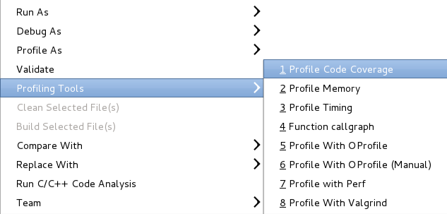

Overview
========

The Gcov plugin allows to visualize in eclipse gcov's output (aka \*.gcda/\*.gcno files).

For more details on gcov, visit the GNU GCov documentation at <http://gcc.gnu.org/onlinedocs/gcc-4.7.0/gcc/Gcov.html> .

Installation and Set-Up
=======================

Gcov plugin depends on binutils (such as addr2line, c++filt and nm). Gcov can be used on any platform as soon as these binutils are in PATH. For example, you can use it on Windows with Cygwin.

Older version Configuration pre 3.2.0
-------------------------------------

First of all, the user has to compile the C/C++ program with profiling enabled using "-ftest-coverage -fprofile-arcs" options prior to running the tool. These two options must be passed via the project properties to both the compiler (C/C++ Build-\>Settings-\>Tool Settings-\>GCC C Compiler-\>Miscellaneous-\>Other flags) and the linker (C/C++ Build-\>Settings-\>Tool Settings-\>GCC C Linker-\>Miscellaneous-\>Linker flags). For a CDT Autotools project, there is a check-box found under the project properties (Autotools-\>Configure Settings-\>configure-\>Advanced-\>Gcov support).

Newer Version Configuration 3.2.\* onwards
------------------------------------------

When the user tires to run gcov for the first time, the user will be asked if he would like eclipse to enable gcov for the user automatically.

This will enable the debug checkbox 'Generate Gcov information' in the setting shown in the following screenshot:

After which the tool will start and generate a new view as the output.

Opening gcov result
===================

Once the application is compiled and run is finished, several "gcno" and "gcda" files are generated under the project.

Double clicking on one of these files will open a dialog to select the associated binary. The dialog allows you to display details only for the file that generated the associated "gcno"/"gcda" file or to display results for all "gcno"/"gcda" files which are part of source files used in a binary executable.

Profiling Code Coverage
=======================

Another way to use the gcov plug-in is to profile your executable using Profiling Tools-\>Profile Code Coverage. This assumes that the executable has been set up to build with the proper compilation flags.

You can also specify the Gcov tool as the profiling tool of choice for Profile as...-\>Local C/C++ Application using the Profiler tab.

Gcov main view
==============

The Gcov view displays an overview of coverage information for the whole project.

 Several buttons are available in the toolbar.

-    : "Export to CSV" button allows you to export the gcov result as a CSV text file, suitable for any spreadsheet.
-    : "Sort coverage per folder" button displays gcov result sorted by folder.
-    : "Sort coverage per file" button displays gcov result sorted by file.
-    : "Sort coverage per function" button displays gcov result sorted by function.

-    : "Create Chart..." button allows you to create a BIRT chart, with the current lines selected in the gcov result view.

Double-clicking on a item in the result view will open the corresponding source location, annotated with coverage informations.

From the annotated editor, a user may determine the hit counts by hovering over the annotation, or the vertical ruler beside a line.

When one begins editing the source file, the annotations will vanish to avoid any confusion. To permanently disable the annotations a rebuild can be performed.

Troubleshooting
===============

If you encounter a problem with gcov plugin, please enter a new issue: <https://github.com/eclipse-linuxtools/org.eclipse.linuxtools/issues/new/choose>
