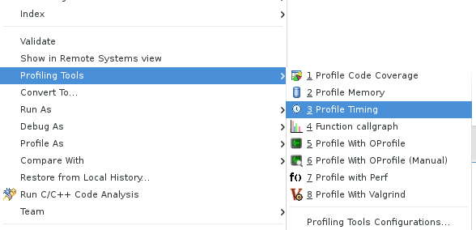

Overview
========

PERF is a performance counters subsystem in Linux. Performance counters are CPU hardware registers that count hardware events such as instructions executed and cache-misses suffered. These counters aid in profiling applications to detect hotspots in the application. PERF provides per task, per CPU and per-workload counters, sampling on top of these and source code event annotation.

The PERF plug-in for Eclipse allows the developer to execute profiles in their applications in a seamlessly way, using quick launch actions and visualizing the results in an user-friendly interface.

Installing
==========

In order for the Perf plug-in for Eclipse to work properly, you need to have the perf tool installed on your system first. Most Linux distributions will likely package this as a package related to the kernel. More information about the perf tool can be found at <https://perf.wiki.kernel.org/> .

Once the *perf* tool is installed, the easiest way to install the Perf plug-in for Eclipse is through the ***Software Updates and Add-ons*** menu. For information on how to use this menu, refer to [this link](https://wiki.eclipse.org/Linux_Tools_Project/PluginInstallHelp#Installing_Updates_From_the_Linux_Tools_Update_Site).

Launching a Profile
===================

Perf plug-in provides useful profile information in a user-friendly interface, gathering the required information from the Perf command-line tool and hooking it into the Eclipse and CDT's facilities.

During a profile run, the Perf plug-in will start, stop and perform other Perf tasks in the background as needed, while the binary being profiled runs as normal.

One-click launch
----------------

The Perf plug-in for Eclipse includes a one-click launch feature which profiles the binary with default options. To use the one-click launch, right click on the project, the binary or in an open editor for a source file belonging to that project.Here there are two ways to start a launch:

Navigating to Profiling Tools and clicking Profile With Perf

or navigating to Profiling Tools, clicking on Profile Timing and setting the timing tools to be Perf

To properly set the preferences you can go to C/C++-\>Profiling-\>Categories-\>Timing and set the default timing tool to be Perf.

You can also set project specific preferences which override workspace preferences by using project Properties-\>C/C++ General-\>Profiling Categories-\>Timing.

You can also profile your application using Profile as...-\>Local C/C++ Application whereby you have set the profiling tool in the Profiler tab to be perf.

Launching a Customized Profile
------------------------------

The Perf plug-in allows you to configure a profile run using several options. These options are exposed via the launch configuration in a user-friendly manner, allowing for a more complex profile.

To customize a profile, right click on the project, the binary or in an open editor for a source file belonging to that project. Then, navigate to Profiling Tools \> Profile Configurations... to open the Profile Configurations menu. Refer to the Profiling Configuration section for more information about configuring a profile.

After configuring a profile, click the Profile button to launch the profile.

Profiling Configuration
=======================

The Perf plug-in has several options to configure, most of them are mirrors of the configuration options that exists on the binary. For more information about all these options refer to the Perf man pages or <https://perf.wiki.kernel.org/> .

Remote Profiling
----------------

It is possible to use RSE or RemoteTools to profile a remote project. In Profile Configurations, after creating a configuration in the Profile with Remote Perf option, it is necessary to search for the project binary. The user can copy the C/C++ executable file from the remote server to the local workstation by selecting the Copy C/C++ executable check box. But the default it to profile the executable file specified in the C/C++ executable field. In this case, you need to browse for the binary. The working directory is automatically set to the underlying project directory, but you can modify it if necessary.

Perf Options tab
----------------

This configuration tab contains runtime options for a profiling with Perf, such as loading a kernel image file or hide unsolved symbols.

Perf Events tab
---------------

On this tab it is possible to set up a customized array of events for the profiling or, if desired, go with the Default Event option which overrides all other settings and run Perf with the default event (cycle counting).

Perf Views
==========

A Perf view is where all the profiling results can be easily read. There are a few different views that may be activated depending on the kind of information a user is interested in.

### Perf Tree View

The Perf Tree View stores profiling information in a tree-like hierarchy.

The tree structure displayed above describes one profile of one or more events in the following manner:

-    Events -- the name of the profiling event used by Perf
    -    Session -- the name of the session the profile is stored in
        -    Image -- the binary being profiled
            -    Symbol -- symbols gathered from the binary's debug information
                -    Sample -- individual Perf samples correlated to line numbers of source code
            -    Dependent Images -- other binaries related to the run of the program; shared libraries or kernel modules
                -    Image -- the dependent binary
                    -    Symbol -- same as above
                        -    Sample -- same as above

### Source Disassembly View

Display the source code of the targeted program alongside its assembly code. This also lists the percentage of samples collected at each instruction.

This option may be enabled from the launch configuration options for Perf.

### Stat View

Display various event information about the execution of the targeted program.

This option may be enabled from the launch configuration options for Perf.

Sessions
========

The perf plug-in allows you to store profiling sessions to keep track of a project's performance history. Furthermore, sessions allow the plug-in to provide a number of comparison features to investigate differences in performance.

Saving a Session
----------------

Currently profile and statistics sessions can be saved by using the menu commands of the respective views. Note that if there has not been a profile or stat run, these commands will be disabled as there would be no data available to save.

These sessions will be located under the profiled project root with their user specified names.

Comparing Sessions
------------------

Comparisons between sessions is supported by this plug-in, allowing for quick feedback about a program's performance.

### Manual Comparison

Comparison of Perf sessions is integrated into the team comparison context menu. Simply select two files generated by either "perf-report" or "perf-stat", right click to get the context menu, go to "Compare With", and click "Each Other". The "Reverse" icon located to the far right within the view can reverse the comparison order.

### Automatic comparison

Automatic comparison actions auto-select the most recent profiling sessions and display their result as above. Note that this type of comparison will only be enabled after profiling your project at least two times to gather enough data to compare.

To start an automatic comparison simply select the "Compare Latest" menu action.

