Overview
========

Welcome to the SystemTap plug-in Help pages. This section is intended to provide users with information and links about the SystemTap scripting language itself, in addition to a brief introduction to SystemTap plug-in's structure for new users and a brief explanation of SystemTap.

The SystemTap Plugin
--------------------

The SystemTap Plugin is designed to help you create, edit, and run SystemTap scripts. It also provides the ability to graph the output of your scripts and run SystemTap scripts remotely.

It provides the **SystemTap IDE** perspective. When in this perspective you should be able to see the Probe view, the Function view, and the Project Explorer. You should also be able to create SystemTap scripts.

SystemTap
---------

SystemTap provides free software (GPL) infrastructure to simplify the gathering of information about the running Linux kernel. This assists diagnosis of a performance or functional problem. SystemTap eliminates the need for the developer to go through the tedious and disruptive instrument, recompile, install, and reboot sequence that may be otherwise required to collect data.

SystemTap provides a simple command line interface and scripting language for writing instrumentation for a live running kernel. The internal tapset library as well as the published samples can be used to aid reuse and abstraction.

Current project members include Red Hat, IBM, Intel, and Hitachi.

Installing
----------

### Requirements

**Hardware Requirements:**

-   x86, x86\_64, ppc64, s390

**Software Requirements:**

-   Linux kernel v2.6.14 or newer
    -   Linux kernel devel and debuginfo packages
-   Eclipse v3.8/v4.2 or newer
-   SystemTap v0.7 or newer

Once all dependencies are installed, the easiest way to install the SystemTap plug-in for Eclipse is through the ***Software Updates and Add-ons*** menu. For information on how to use this menu, refer to [this link](https://wiki.eclipse.org/Linux_Tools_Project/PluginInstallHelp#Installing_Updates_From_the_Linux_Tools_Update_Site).

### Kernel Source Location

In order to use the kernel source browser, you will need to point it to the kernel source initially. SystemTap IDE will be set with a default kernel source path by default, but it may be necessary to set it manually. Do this by either selecting the Kernel Source Browser in the browser pane or by going to **<u>W</u>indow-\><u>P</u>references**, then going to the SystemTap-\>IDE-\>'Kernel Source Path' tab. It is possible to explore the kernel source in your local machine or in the same machine used to run SystemTap scripts. Enter your option and inform the kernel source location. If you selected the remote option, it is necessary to set up the remote machine information at SystemTap-\>'Remote Server' tab.

### Tutorials

If you haven't already, you will want to take the IDE and Graphing tutorials. You can find them in the Getting Started section of each perspective's help pages. These tutorial provides fundamental knowledge on graphing in SystemTap plug-in.

### Preferences (Optional)

Finally, you may want to set certain non-essential preferences before using SystemTap plug-in regularly. Use **<u>W</u>indow-\><u>P</u>references** to access the Preferences page.

Links to SystemTap Resources
----------------------------

The following links contain information specific to the SystemTap scripting language.

-   **SystemTap website** - <http://sourceware.org/systemtap/>
-   **SystemTap wiki** - <http://sourceware.org/systemtap/wiki>
-   **SystemTap tutorial** - <http://sourceware.org/systemtap/tutorial/>
-   **Full list of documentation** - <http://sourceware.org/systemtap/documentation.html>

SystemTap IDE
=============

Getting Started
---------------

### IDE Tutorial

#### Lesson 1: Getting Started

In this tutorial we will orient you with the SystemTap IDE and its functions. At this point we assume that you are able to run SystemTap plug-in and are unfamiliar with how to proceed. If you cannot yet start the application, please refer to our [ Installation help page](#installation "wikilink"). **NOTE:** If this is your the first time opening the SystemTap IDE, it will take a while to load as it has to parse the tapsets.

The SystemTap IDE's purpose is to allow the user to create, view, and edit SystemTap scripts. There are other editors built in (plain text and the C editor), however, they ultimately exist to facilitate the writing of SystemTap scripts.

In this lesson we will open a new SystemTap script file to familiarize ourselves with the SystemTap IDE. If you don't already have a project you plan to put your new script in, start by creating a new one. Select the <u>F</u>ile menu -\> New -\> Project -\> General -\> Project. Follow the wizard to create a new project.

Now you are ready to create the script. Select File -\> New -\> Other -\> SystemTap -\> SystemTap Script. Follow the wizard to provide your script name and the project which will contain it (use the project we created above).

This should open up a new editor with a small stub of a script.

At this point proceed to [ Lesson 2: Writing Your First Script](#lesson-2:-writing-your-first-script "wikilink") if you wish to learn how to write your own script file or [ Lesson 3: Running Your Script](#lesson-3:-running-your-script "wikilink") if you wish to run this one.

#### Lesson 2: Writing Your First Script

In this tutorial we will guide you through the process of writing your first SystemTap script. It is strongly recommended that you review the **SystemTap website's tutorial** - <http://sourceware.org/systemtap/tutorial> for up-to-date information on the latest version of SystemTap.

In the previous lesson we created a new script and opened it in the editor.

Now try writing a new script or type/copy the following example:

    global read, write, start

    probe begin {
        start = gettimeofday_s()
    }

    probe syscall.write {
        write += count
    }

    probe timer.ms(1000) {
        printf("%d\t%d\t%d\n", (gettimeofday_s()-start), read, write)
        read=0
        write=0
    }

Now to demonstrate the functionality of the Probe Alias browser we will have you complete the read probe yourself. Start by opening the syscall folder in the Probe Alias browser. If you do not have any content in the browser, you are experiencing a problem with SystemTap installation and should refer to our [Installation help page](#installation "wikilink"). Now search for the "syscall.read" probe alias and double click it. SystemTap IDE will insert the skeleton probe at the end of your script, and should look similar to the following:

    probe syscall.read
    {
        /*
         * available variables on this probe:
         * $buf:long int, $count:long int, $fd:long int, $ret:long int,
         * argstr:string, buf_uaddr:long, count:long, fd:long, name:string
         */

    }

Now insert the following line into the syscall.read probe:

    read += count

You may remove the comment (/\* ... \*/) if you wish. This will count the number of bytes read and written each second and print it out. The begin probe executes first, by getting the time of day. The read and write probes increment each time the function is called. The timer probe prints the information every second.

Another way to get assistance while writing a new probe is to press Ctrl+Space at any point during editing. Doing so will provide auto-completion for partially spelled probe names, what variables and functions are available inside a probe, and documentation where available.

In [Lesson 3](#lesson-3:-running-your-script "wikilink") you will learn how to run SystemTap scripts.

#### Lesson 3: Running Your Script

In this lesson we will cover running your script. You may use either the script you wrote in Lesson two or write a new one.

There are two ways to run a script:

-    **Simple Run** - Clicking this button in the toolbar will run the current script as the current user on the local machine, and will print all script output to the Eclipse console.
-   **Run Configuration** - For more control over running options, you can use a Run Configuration. To run a script with an existing Run Configuration, open the script file you want to run, then do any of the following:
    -   right-click on the script editor or the script file in the Project Explorer, and select **Run As-\>SystemTap Script**
    -   click on the  **Run As...** button on the toolbar
    -   select either **Run-\>Run** or **Run-\>Run As-\>SystemTap Script** on the menu bar
    -   press Ctrl+F11 on the keyboard

If any of these options are used when a Run Configuration is not yet created for the script, a new one with default settings will be created for it. If multiple Run Configurations exist, you will be prompted to select which one to run the script with.

If you know which Run Configuration you want to use, you may simply click the arrow next to the  **Run As** button on the toolbar and select from a list of recently-run configurations.

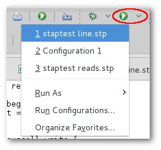

To create a new Run Configuration, right-click on the script editor or the script file in the Project Explorer then select **Run As -\> Run Configurations...**. Once the dialogue pops up, double click on the SystemTap tree item and you should be presented with the following dialogue:

Here you can specify the path of the script to run, enter remote host information, run as a different user, as well as various other options for running SystemTap. Explore the various tabs and options. The tooltips should provide help in understanding what the various options do. When you are ready, click Run to run your script.

Now we will demonstrate running SystemTap scripts with graphs. In order to run the chart example you'll need to use the code provided in [ Lesson 2: Writing Your First Script](#lesson-2:-writing-your-first-script "wikilink"):

    global read, write, start

    probe begin {
        start = gettimeofday_s()
    }

    probe syscall.write {
        write += count
    }

    probe syscall.read {
        read += count
    }

    probe timer.ms(1000) {
        printf("%d\t%d\t%d\n", (gettimeofday_s()-start), read, write)
        read=0
        write=0
    }

To do this, select **Run As -\> Run Configurations...** and create a new SystemTap Launch Configuration as you did previously and switch to the Graphing tab. By the end of this tutorial, the tab will look like this:

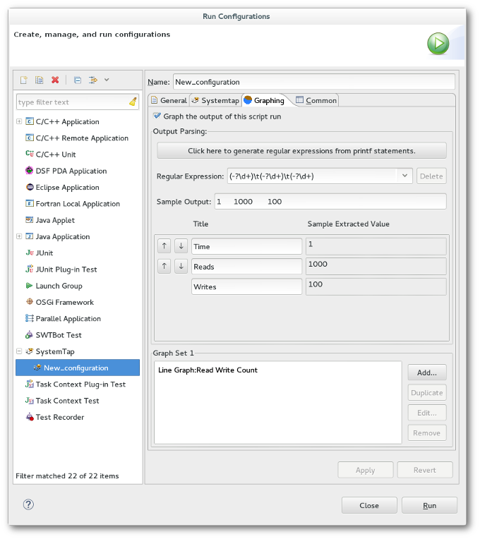

The following instructions will walk you through the steps towards configuring the graph settings as shown above.

First, select **Graph the output of this script run**, and in the text box labeled **Regular Expression**, enter a regular expression that will match the output of your script. Place parentheses () around whatever data you want to capture for graphing.

For this example, enter the following as your **Regular Expression**:

    (\d+)\t(\d+)\t(\d+)

Alternatively, you can click the button labeled **Click here to generate regular expressions from printf statements.** Clicking this button will automatically create regular expressions that will capture output created by the script's printf statements.

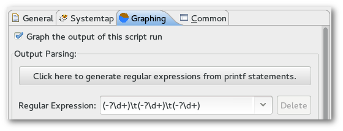

This expression will capture the output produced by the example script. Note that in order to capture data from script output, the output must be formatted into lines/rows. Output-parsing regular expressions try to match individual lines of script output, so make sure your scripts print a line break ("\\n") to mark the end of a line. (The line break character does not need to be included in the regular expression.)

Once this expression is entered, a table of **Title**s and **Sample Extracted Value**s will appear. To test that your regular expression is working as intended, you may enter as **Sample Output** a line of text similar to what you expect your script to produce.

For this example, copy and paste the following line into the **Sample Output** box:

    10 1000    100

and enter the following as **Titles**:

    Time
    Reads
    Writes

The text boxes displayed under **Sample Extracted Value** now show you the values that are captured by your regular expression, which will be plotted in any graphs you create that use those values.

Now to add a graph using the parsed output, click the **Add...** button in the Graph Set section, which will bring up the [ Create Graph](#create-graph-wizard "wikilink") wizard. Select a line graph as the **Graph Type**, and enter the following as your Title and series values, then click **Finish** to save your changes:

    Title:     Read Write Count
    X Series:   Time
    Y Series 0: Reads
    Y Series 1: Writes

You may also specify additional regular expressions to capture output with. To do this, either press the Down arrow key while typing into the **Regular Expression** text box, or click the drop-down arrow of the text box and click the entry labeled **New Regular Expression...**

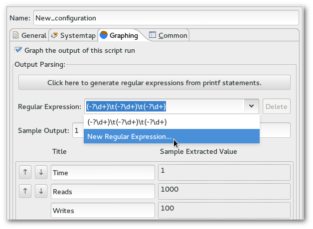

You will notice that all data entered in the Graphing menu so far, such as the sample output and graphs, will no longer visible after adding a new regular expression. This is because each regular expression has its own sample output, column titles, and set of graphs (or Graph Set) associated with it. Data for the currently-selected expression is displayed, and since the current expression is blank, so are the column & graph settings.

To capture the example script's output only at intervals of 10 units of time, use the line below as your second regular expression:

    (\d+0)\t(\d+)\t(\d+)

Enter the same sample output & title values that were used for the first regular expression. Also add a graph with the same series data as before, and with a title of "Decade Read Write Counts".

When the script is executed under this Run Configuration, the Graph Selector view is opened and it will contain a Data View and any graphs you have created, with a tab for each regular expression's set of graphs. The Data View chart is populated with the output from the console. If you click on the tab labeled **Graph Set 1**, you should see a screen similar to the following:

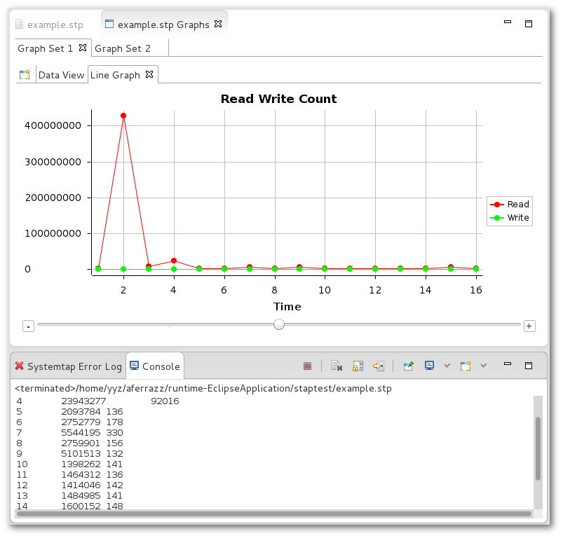

Switch between the graphs in Graph Set 1 and 2 to see the difference between the two graphs you plotted. If you click on the **Data View** tab of either Graph Set, you will see that the data that is being parsed live from the console:

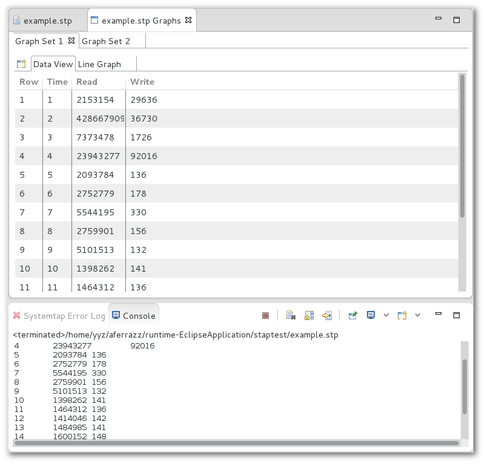

You may also create new graphs while in this view, to display data captured by your regular expressions in alternate ways. To create a new graph, first select the Graph Set you want to add a new graph to, then click on the  **Create Graph** button, which appears to the left of the Data View tab. This will bring up the same [ Create Graph](#create-graph-wizard "wikilink") wizard that appears when creating a graph in a script's Run Configurations menu.

Concepts
--------

### SystemTap IDE Perspective

This is the primary perspective for SystemTap script writers. It contains the [ Function Browser](#function-browser "wikilink"), [ Kernel Browser](#kernel-browser "wikilink"), [ Probe Alias Browser](#probe-alias-browser "wikilink"), and [ Views and Editors](#views-and-editors "wikilink"). The IDE Perspective contains the features necessary execute SystemTap scripts and the syntax coloring and code completion features that facilitate efficient development of scripts.

### STP Editor

This editor is the most commonly used; it is used for the authoring and editing of SystemTap scripts. It is invoked when the user starts a new file or opens a file with the .stp extension. It provides syntax highlighting, code completion, and run support.

See also: [ Menus](#menus "wikilink"), [ Example SystemTap Scripts](#example-systemtap-scripts "wikilink"), [ Toolbars](#toolbars "wikilink")

### Function Browser

The Function Browser lists all of the functions that are defined in the tapset library. Functions are grouped by the file that they are defined. Each listed function has an icon that corresponds to its return type.

-    String
-    Long
-    Void
-    Unknown

If you double click on any function a call to that function will be added to the active editor at the current cursor location. Also if you right click on a function and click **View Definition** the tapset file where the function is defined will be opened.

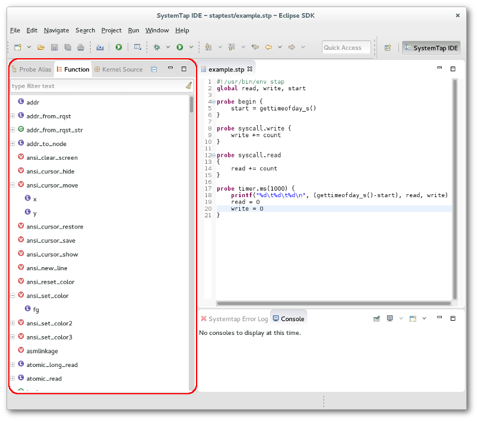

The default behavior of this view is to look for functions in the tapset library in the local machine. To look for functions in the same machine used to run the SystemTap scripts, go to Window-\>Preferences, select SystemTap-\>SystemTap IDE and check the *Use remote connection to load SystemTap probes and functions* option. Don't forget to configure the remote server used by remote execution in SystemTap-\>Remote Server.

### Kernel Browser

The Kernel Source Browser is used to display the kernel tree. This provides you with a quick way to locate places to add probes. Any file in the Kernel Source tree can be opened by double clicking on it. This will open up the selected file in the Editor view. You can then double click on the ruler next to any line that you wish to probe. If SystemTap can probe that line a probe point will be inserted at the end of the script you were most recently working on. If the line can't be probed, an error message will be displayed.

To use this feature it is necessary to configure the [Kernel Source Location](https://wiki.eclipse.org/Linux_Tools_Project/SystemTap/User_Guide#Kernel_Source_Location).

### Probe Alias Browser

The Probe Alias Browser lists all of the probe aliases that are defined in the tapset library, as well as all static probes defined internally by SystemTap. Probes are grouped by name. In addition to the list of probes, each probe lists all of the variables that it has access to. Each variable is listed with an icon that represents its data type. Types are as follows:

-    String
-    Long
-    Struct
-    Unknown

If you double click on any probe alias, probe point will be added to the end of the active editor. Also if you right click on a probe and click **View Definition** the tapset file where the probe is defined will be opened.

The default behavior of this view is to look for probes in the local machine. To look for probes in the same machine used to run the SystemTap scripts, go to Window-\>Preferences, select SystemTap-\>SystemTap IDE and check the *Use remote connection to load SystemTap probes and functions* option. Don't forget to configure the remote server used by remote execution in SystemTap-\>Remote Server.

Tasks
-----

### Creating SystemTap Scripts

Create a SystemTap script by selecting **File -\> New -\> Other... -\> SystemTap -\> SystemTap Script** from the menu bar. You'll be prompted to enter a name for the file; *make sure that you use a .stp extension or else the SystemTap IDE will not recognize the file as a SystemTap script and certain editor and run features will not be active.*

Your new file will be open and ready for coding in the Editor pane.

A [ IDE Tutorial](#ide-tutorial "wikilink") is also provided in the help pages for a step by step demo.

For advanced SystemTap language help please see the SystemTap Development User's Guide and the documentation available at the SystemTap website's documentation page - <http://sourceware.org/systemtap/documentation.html>

### Using the STP Editor

The STP Editor is used for the authoring and editing of SystemTap scripts. It is invoked when the user starts a new file or opens a file with the .stp extension. Using the editor is as easy as setting the focus to the editor pane and typing.

There are certain features within the editor you may want to take advantage of:

-   Syntax Highlighting - Certain code items are colored in .stp and .c files based on a set of rules and colors.
-   Code Assist - SystemTap IDE will attempt to finish your probe alias names based on what you have already typed. You can then select the appropriate probe alias or continue typing to filter the list down even more.
-   Run Support - See the [ Lesson 3: Running Your Script](#lesson-3:-running-your-script "wikilink") help page on a walk through use of the Run command. The Run command allows scripts to be executed directly through SystemTap IDE.

See also: [ Menus](#menus "wikilink"), [ Toolbars](#toolbars "wikilink"), [ Example SystemTap Scripts](#example-systemTap-scripts "wikilink")

### Creating Run Configurations

Advanced options for running SystemTap scripts are available in the **Run Configurations** menu. This menu may be accessed by right-clicking a script and choosing **Run As-\>Run Configurations** from the context menu, by selecting **Run-\>Run Configurations** in the menu bar, or by using the drop-down menu next to the  **Run** toolbar button.

#### Local/Remote Runs

It is possible to run scripts either locally or remotely, and as different users. To configure these settings, use the **General** tab of the Run Configurations menu.

The following options are available:

-   **Execute script as current user** - Uncheck this box to run the script as a different user. While unchecked, you may enter the **User Name** and **Password** of the user you wish to run the script as.
-   **Run script on localhost** - Uncheck this box to run the script on a remote machine. Type the name of the desired host to use in **Host Name**. (This option is only available when running as a non-current user.)
-   **Use default port** - When unchecked, you may specify the port that is to be used for remote communication. The default port is 22. (This option is only available when running on a non-local host.)

#### SystemTap Options

The **SystemTap** tab allows for the specification of many command-line options to the stap command that is to be run. View the SystemTap manual for information on these options - <https://sourceware.org/systemtap/man/stap.1.html>

#### Graphing

Many options and features are available in the **Graphing** tab for creating graphs out of a script's output. For detailed information on how to create graphs, refer to [ Lesson 3: Running Your Script](#lesson-3:-running-your-script "wikilink") and the [ Graphing Tutorial](#graphing-tutorial "wikilink").

### Viewing Data Charts

Viewing data charts from a SystemTap script is accomplished by running that script with the Run Configurations containing your graphs. This is covered in [ Lesson 3: Running Your Script](#lesson-3:-running-your-script "wikilink"). After running a script with the graphing option, the user is presented with the Graph Selector View, and the last graph of the final Graph Set is loaded by default. When that view appears, click on the Data View tab of any Graph Set to see it begin populating as it receives input back through the console from the running SystemTap script.

Reference
---------

### Views and Editors

This section details the views and editor in relation to the SystemTap IDE.

#### Views

The IDE Perspective consists of 5 views and and two editors.

-   **Probe Alias Browser** - A list of all probe aliases currently available in your version of SystemTap and all active tapsets. Covered in detail [ here](#probe-alias-browser "wikilink").
-   **Function Browser** - A list of functions currently supported in your version of SystemTap and all active tapsets. Covered in detail [ here](#function-browser "wikilink").
-   **Kernel Source Browser** - Used to display the kernel tree. Covered in detail [ here](#kernel-browser "wikilink").
-   **Console** - The console view is where all of the output from the running script is shown. If more then one script is running at the same time you are able to switch between which console is currently displayed by clicking on the **Display Selected Console** button. The script can halt execution here if the user selects the **Stop** button. The user also has the option of saving the console output to a file, which can be done while the script is running by clicking the **Save log output** button at the top of the console.

-   **Error Log** - If the script you tried to run contained errors, this view will become active and display the errors. You can double click on the error message to jump to the line in the file where the error occurred.

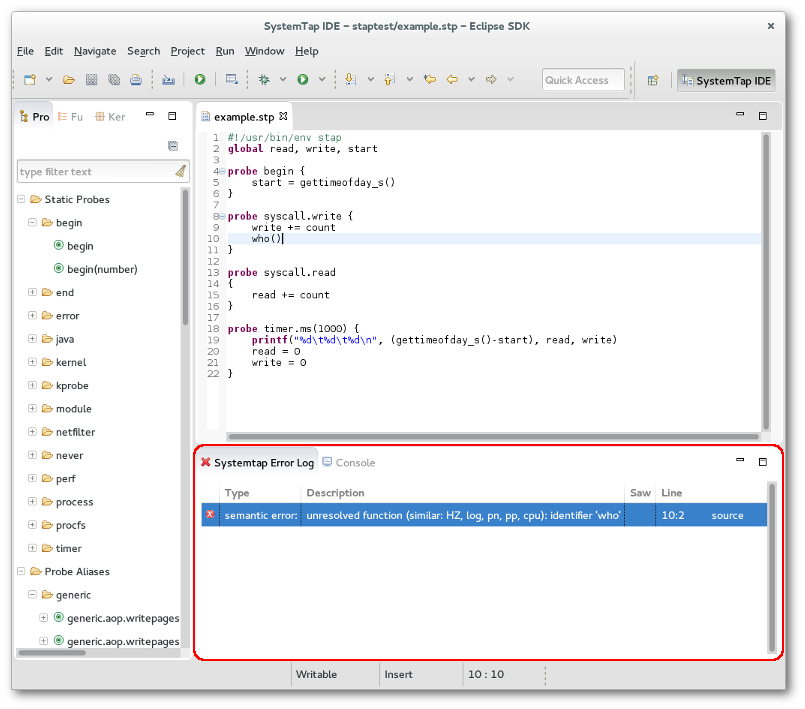

#### Editors

Three editors are available in the SystemTap IDE.

-   **STP Editor** - This editor is the most commonly used; it is used for the authoring and editing of SystemTap scripts. It is invoked when the user starts a new file or opens a file with the .stp extension. It provides syntax highlighting, code completion, and run support.
-   **C Editor** - This editor is available for the read only viewing of kernel source. It is invoked when the user opens a file of extension .c. Syntax highlighting is supported in this mode.
-   **Plain Text Editor** - A plain text editor is also implemented for the user should they need it.

### Menus

What follows is a comprehension list of the menu options available within the SystemTap IDE.

#### Edit

-   **<u>U</u>ndo** - Undos the previous editor related action. (Shortcut: Ctrl+Z)
-   **<u>R</u>edo** - Redos the previous editor related action removed by Undo. (Shortcut: Ctrl+Y)
-   **Cu<u>t</u>** - Removes the selected text from the editor pane and places it in the clipboard. (Shortcut: Shift+Delete, Ctrl+X)
-   **<u>C</u>opy** - Copies the selected text from the editor pane and places it in the clipboard. (Shortcut: Ctrl+Insert, Ctrl+C)
-   **<u>P</u>aste** - Copies the text from the clipboard to the location of the focus in the editor pane. (Shortcut: Shift+Insert, Ctrl+V)
-   **Select <u>A</u>ll** - Selects all text within the file in the editor that the focus is currently in. (Shortcut: Ctrl+A)
-   **<u>F</u>ind/Replace** - Opens the Find/Replace dialogue in which users may specify a text string to find and/or replace, with options to search forwards or backwards, the entire document or just the selected lines, and whether or not they want the following options:
    -   Case sensitive
    -   Wrap Search
    -   Whole Word
    -   Incremental
    -   Regular expressions

(Shortcut: Ctrl+F)

-   **Find <u>N</u>ext** - Finds the next instance of the search string in the direction indicated in the Find/Replace dialogue box. (Shortcut: Ctrl+K)
-   **Find Pre<u>v</u>ious** - Finds the previous instance of the search string in the direction indicated in the Find/Replace dialogue box. (Shortcut: Shift+Ctrl+K)
-   **<u>I</u>ncremental Find Next** - Finds the next occurrence of the text and updates the selection after each character typed. To use Incremental Find:
    -   In the text (or Java) editor, press Ctrl+J or select Edit \> Incremental Find Next from the menu bar.
    -   The workbench status line displays **Incremental Find:**. The editor is now in the Incremental Find mode.
    -   As you type, the editor finds the next occurrence of the text and updates the selection after each character typed.
    -   Navigate to the next or previous match by pressing Arrow Down or Arrow Up.
    -   Undo the last action within the Incremental Find mode by pressing Backspace.
    -   You can leave the Incremental Find mode by pressing Esc
-   **Incre<u>m</u>ental Find Previous** - Operates as illustrated in above bullet but in the reverse. (Shortcut: Shift+Ctrl+J)
-   **Select <u>A</u>ll** - Selects all the text in the file that currently has the focus. (Shortcut: Ctrl+A)
-   **<u>W</u>ord Completion** - Completes the string being typed by using the last example typed by the user. (Shortcut: Alt+/)

#### Navigate

-   **<u>F</u>orward** - Navigates to the next file in sequence as they were opened in the editor pane. (Shortcut: Alt+Right)
-   **<u>B</u>ack** - Navigates to the previous file in sequence as they were opened in the editor pane. (Shortcut: Alt+Left)
-   **Last Edit Lo<u>c</u>ation** - Moves the focus to the file containing the last known edit. (Shortcut: Ctrl+Q)
-   **<u>G</u>oto Line...** - Moves the focus to the specified line number, with the range of line numbers listed in the dialogue box. (Shortcut: Ctrl+L)

#### Run

-   **<u>R</u>un** - Available when a SystemTap script is loaded into the editor, this feature runs the script. You will be prompted to run the script either locally or on a remote machine. If run locally and multiple Run Configurations exist for the script, you will be prompted to choose which of them to run. (Shortcut: Ctrl+F11)

#### Window

-   **<u>N</u>ew Window** - This option opens a new instance of the SystemTap IDE.
-   **<u>O</u>pen Perspective** - This submenu lists each of the available perspectives to open:
    -   SystemTap IDE
    -   Other... - Lists all other perspectives available to Eclipse.
-   **Show <u>V</u>iews** - This submenus lists each of the available views to open:
    -   Console
    -   Functions
    -   Kernel Source
    -   Probe Alias
    -   SystemTap Error Log
    -   Other... - Lists all views in the application.
-   **<u>P</u>references** - Due to the breath of this topic it is covered in another section. Please see [ Preferences](#preferences "wikilink").

### Toolbars

#### Action Bar

-    **New File** - This button will bring up a dialogue to create a new file. When you click OK the file will be opened in the editor window.
-    **Simple Run** - This will compile the open script and start running it, without using a Run Configuration. All output will be sent to the console. If there is an error in the script the error will be reported in the Error Log.
-    **Run As** - This compiles & runs the current script, but also searches for a Run Configuration that targets the script, and runs the script with the launch options provided by it. Use this instead of Simple Run when you want graphs to be plotted. (Shortcut: Ctrl+F11)

### Preferences

This section details each of the options listed under **<u>W</u>indow-\><u>P</u>references**. The Preferences dialog is used to set user preferences. Its pages can be searched using the filter function. To filter by matching the page title, simply type the name of the page you are seeking in the text box in the top-left corner of the dialog, and the available pages will be presented in the list below. The filter also searches on keywords such as "appearance" and "Java".

-   **SystemTap** - This section contains options relevant to SystemTap itself.
    -   **Environment Variables** - Allows the user to set specific values to the following environment variables
        -   LD\_LIBRARY\_PATH
        -   PATH
        -   SYSTEMTAP\_TAPSET
        -   SYSTEMTAP\_RUNTIME
    -   **Graphing** - Preferences related to the Graphing Perspective.
        -   **<u>R</u>efresh Delay (ms)** - Milliseconds between graphs are updated with the latest data.
        -   **Data Table** - Preferences related to the data table.
            -   <u>J</u>ump to the newest entry - Determines whether the scroll bar maintains its location at the newest entry.
            -   <u>A</u>uto resize columns - Determines whether columns automatically resize to the width of the contents or whether they can be adjusted by the user.
            -   <u>M</u>ax data items - Maximum number of entries that the table shows, though the table itself may have more not visible.
        -   **Graph** - Preferences related to graphs.
            -   <u>S</u>how X/Y grid lines - Turns on and off painting of the grid lines for either axis.
            -   <u>M</u>ax data items - Number of maximum samples read from a script's output.
            -   <u>V</u>iewable data items - Number of maximum samples plotted at any time.
            -   <u>X</u>/<u>Y</u> series ticks - Specify the number of labeled number markers on either axis.
    -   **IDE** - Preferences when loading the IDE Perspective.
        -   **Use stored tapset trees** - If checked, the next initialization of SystemTap IDE will load all tapset contents (probes & functions) from a local configuration file instead of having to search for them manually. This configuration file is saved whenever changes to tapsets are made while this box is checked, or when it is checked for the first time.
        -   **Use remote connection to load SystemTap probes and functions** - If checked, tapset contents (probes & functions) will be loaded from a remote machine (specified in Remote Server) instead of the local machine.
        -   **Kernel Source Path** - Location of the directory that the kernel source code is pulled from. A local or remote machine may be used.
            -   Tapsets - Preferences related to tapsets.
                -   <u>A</u>dditional Tapsets - Allows you to specify additional tapsets scripts to be added in with every script, and to be displayed in the Function and Probe Alias Browsers.
    -   **Remote Server** - Details regarding running SystemTap on a remote machine. Any operations that run SystemTap on a remote machine will use the one specified by the credentials provided here.
        -   **Host Name** - IP address of the remote machine.
        -   **Port** - Port used for communication. Default is 22462.
        -   **User Name** - User name that has sufficient permissions to transfer and run the script on the remote machine.
        -   **Password** - Password for the above user.

### Frequently Asked Questions

This section details frequently asked questions relating to the IDE Perspective.

**Where can I find information regarding the SystemTap scripting language?**

A: The best place to look for up to date information regarding SystemTap itself is its homepage - <http://sourceware.org/systemtap/documentation.html>

**How do I run a script once I've written it?**

A: There are two ways to run a script: -with the  Simple Run button on the toolbar, which runs the script that has editor focus. It will be run without drawing graphs or any other configurations. -by launching it with a Run Configuration that targets any specified script, even one that is not in the workspace.

Read [ Lesson 3: Running Your Script](#lesson-3:-running-your-script "wikilink") and [ Menus](#menus "wikilink") to learn more about the ways of running SystemTap scripts.

**Why does the application seem to hang when switching to the SystemTap IDE?**

A: If this is the first time you are trying to open the SystemTap IDE, or have recently gotten a new version of SystemTap this is expected. In order to generate a full list of all of the available probes and functions, the GUI has to run a background SystemTap process and parse the results. A future update to SystemTap IDE will reduce the duration of this operation.

### Example SystemTap Scripts

What follows is a few SystemTap Scripts that you may use in SystemTap IDE, taken from and linked to <http://sourceware.org/systemtap/documentation.html>

There is also a description of the examples - <http://sourceware.org/systemtap/examples/demo_script.txt>

#### top.stp - Prints the top 20 system calls (http://sourceware.org/systemtap/examples/top.stp)

    #!/usr/bin/env stap
    #
    # This script continuously lists the top 20 system calls on the system
    #

    global syscalls

    function print_top () {
        cnt=0
        log ("SYSCALL\t\t\t\tCOUNT")
        foreach ([name] in syscalls-) {
            printf("%-20s\t\t%5d\n",name, syscalls[name])
            if (cnt++ = 20)
                break
        }
        printf("--------------------------------------\n")
        delete syscalls
    }

    probe kernel.function("sys_*") {
        syscalls[probefunc()]++
    }

    # print top syscalls every 5 seconds
    probe timer.ms(5000) {
        print_top ()

#### prof.stp - Simple profiling (http://sourceware.org/systemtap/examples/prof.stp)

    #!/usr/bin/env stap

    # This is an example of profiling a specific command or pid.
    # It works by recording the time when a system call is entered
    # exited.

    # Usage: prof.stp -c "top -n5"
    # Will start up "top" and after 5 iterations, will exit.
    #
    # Usage: prof.stp -x 3323
    # Will profile pid 3323 until it ^c is hit.
    #

    probe kernel.function("sys_*") {
        if (target() = tid())
            calltime[tid()] = gettimeofday_us()
    }

    probe kernel.function("sys_*").return {
        if (target() != tid())  next
        now = gettimeofday_us()
        c = calltime[tid()]
        if (!c) next
        ttime[probefunc()] <<< now - c
        delete calltime[tid()]
    }

    probe end {
        printf("\n")
        foreach (x in ttime)
            printf("%-20s\tcalls:%6d\tavg time (ms):%5d\ttotal(ms):%7d\n",
                x, @count(ttime[x]), @avg(ttime[x]), @sum(ttime[x]))
    }

    global calltime, ttime

#### keyhack.stp - Modifying variables in the kernel. (http://sourceware.org/systemtap/examples/keyhack.stp)

    #! /usr/bin/env stap

    # This is not useful, but it demonstrates that
    # SystemTap can modify variables in a running kernel.

    # Usage: ./keyhack.stp -g

    probe kernel.function("kbd_event") {
        # Changes 'm' to 'b' .
        if ($event_code = 50) $event_code = 48
    }

    probe end {
        printf("\nDONE\n")
    }

#### kmalloc.stp - Statistics example. (http://sourceware.org/systemtap/examples/kmalloc.stp)

    #! /usr/bin/env stap

    # Using statistics to examine kernel memory allocations

    global kmalloc

    probe kernel.function("__kmalloc") {
        kmalloc <<< $size
    }

    # Exit after 10 seconds
    probe timer.ms(10000) { exit () }

    probe end {
        printf("Count:   %d allocations\n", @count(kmalloc))
        printf("Sum:     %d Kbytes\n", @sum(kmalloc)/1000)
        printf("Average: %d bytes\n", @avg(kmalloc))
        printf("Min:     %d bytes\n", @min(kmalloc))
        printf("Max:     %d bytes\n", @max(kmalloc))    
        print("\nAllocations by size in bytes\n")
        print(@hist_log(kmalloc))
    }

#### kmalloc2.stp - Example using arrays of statistics. (http://sourceware.org/systemtap/examples/kmalloc2.stp)

    #! /usr/bin/env stap

    # Using statistics and maps to examine kernel memory allocations

    global kmalloc

    probe kernel.function("__kmalloc") {
        kmalloc[execname()] <<< $size
    }

    # Exit after 10 seconds
    probe timer.ms(10000) { exit () }

    probe end {
        foreach ([name] in kmalloc) {
            printf("Allocations for %s\n", name)
            printf("Count:   %d allocations\n", @count(kmalloc[name]))
            printf("Sum:     %d Kbytes\n", @sum(kmalloc[name])/1000)
            printf("Average: %d bytes\n", @avg(kmalloc[name]))
            printf("Min:     %d bytes\n", @min(kmalloc[name]))
            printf("Max:     %d bytes\n", @max(kmalloc[name]))  
            print("\nAllocations by size in bytes\n")
            print(@hist_log(kmalloc[name]))
            printf("-------------------------------------------------------\n\n");
        }
    }

### Guide to Regular Expressions

Regular expressions are used for SystemTap graphs to interpret information that it recieves from a script's output.

Basic regex (taken from "<http://java.sun.com/j2se/1.5.0/docs/api/> ) -

     Summary of regular-expression constructs

    Construct   Matches

    Characters
    x   The character x
    \\  The backslash character
    \0n     The character with octal value 0n (0 <= n <= 7)
    \0nn    The character with octal value 0nn (0 <= n <= 7)
    \0mnn   The character with octal value 0mnn (0 <= m <= 3, 0 <= n <= 7)
    \xhh    The character with hexadecimal value 0xhh
    \uhhhh  The character with hexadecimal value 0xhhhh
    \t  The tab character ('\u0009')
    \n  The newline (line feed) character ('\u000A')
    \r  The carriage-return character ('\u000D')
    \f  The form-feed character ('\u000C')
    \a  The alert (bell) character ('\u0007')
    \e  The escape character ('\u001B')
    \cx     The control character corresponding to x

    Character classes
    [abc]   a, b, or c (simple class)
    [^abc]  Any character except a, b, or c (negation)
    [a-zA-Z]    a through z or A through Z, inclusive (range)
    [a-d[m-p]]  a through d, or m through p: [a-dm-p] (union)
    [a-z&&[def]]    d, e, or f (intersection)
    [a-z&&[^bc]]    a through z, except for b and c: [ad-z] (subtraction)
    [a-z&&[^m-p]]   a through z, and not m through p: [a-lq-z](subtraction)

    Predefined character classes
    .   Any character (may or may not match line terminators)
    \d  A digit: [0-9]
    \D  A non-digit: [^0-9]
    \s  A whitespace character: [ \t\n\x0B\f\r]
    \S  A non-whitespace character: [^\s]
    \w  A word character: [a-zA-Z_0-9]
    \W  A non-word character: [^\w]

    POSIX character classes (US-ASCII only)
    \p{Lower}   A lower-case alphabetic character: [a-z]
    \p{Upper}   An upper-case alphabetic character:[A-Z]
    \p{ASCII}   All ASCII:[\x00-\x7F]
    \p{Alpha}   An alphabetic character:[\p{Lower}\p{Upper}]
    \p{Digit}   A decimal digit: [0-9]
    \p{Alnum}   An alphanumeric character:[\p{Alpha}\p{Digit}]
    \p{Punct}   Punctuation: One of !"#$%&'()*+,-./:;<=>?@[\]^_`{|}~
    \p{Graph}   A visible character: [\p{Alnum}\p{Punct}]
    \p{Print}   A printable character: [\p{Graph}\x20]
    \p{Blank}   A space or a tab: [ \t]
    \p{Cntrl}   A control character: [\x00-\x1F\x7F]
    \p{XDigit}  A hexadecimal digit: [0-9a-fA-F]
    \p{Space}   A whitespace character: [ \t\n\x0B\f\r]

    java.lang.Character classes (simple java character type)
    \p{javaLowerCase}   Equivalent to java.lang.Character.isLowerCase()
    \p{javaUpperCase}   Equivalent to java.lang.Character.isUpperCase()
    \p{javaWhitespace}  Equivalent to java.lang.Character.isWhitespace()
    \p{javaMirrored}    Equivalent to java.lang.Character.isMirrored()

    Classes for Unicode blocks and categories
    \p{InGreek}     A character in the Greek block (simple block)
    \p{Lu}  An uppercase letter (simple category)
    \p{Sc}  A currency symbol
    \P{InGreek}     Any character except one in the Greek block (negation)
    [\p{L}&&[^\p{Lu}]]      Any letter except an uppercase letter (subtraction)

    Boundary matchers
    ^   The beginning of a line
    $   The end of a line
    \b  A word boundary
    \B  A non-word boundary
    \A  The beginning of the input
    \G  The end of the previous match
    \Z  The end of the input but for the final terminator, if any
    \z  The end of the input

    Greedy quantifiers
    X?  X, once or not at all
    X*  X, zero or more times
    X+  X, one or more times
    X{n}    X, exactly n times
    X{n,}   X, at least n times
    X{n,m}  X, at least n but not more than m times

    Reluctant quantifiers
    X??     X, once or not at all
    X*?     X, zero or more times
    X+?     X, one or more times
    X{n}?   X, exactly n times
    X{n,}?  X, at least n times
    X{n,m}?     X, at least n but not more than m times

    Possessive quantifiers
    X?+     X, once or not at all
    X*+     X, zero or more times
    X++     X, one or more times
    X{n}+   X, exactly n times
    X{n,}+  X, at least n times
    X{n,m}+     X, at least n but not more than m times

    Logical operators
    XY  X followed by Y
    X|Y     Either X or Y
    (X)     X, as a capturing group

    Back references
    \n  Whatever the nth capturing group matched

    Quotation
    \   Nothing, but quotes the following character
    \Q  Nothing, but quotes all characters until \E
    \E  Nothing, but ends quoting started by \Q

    Special constructs (non-capturing)
    (?:X)   X, as a non-capturing group
    (?idmsux-idmsux)    Nothing, but turns match flags on - off
    (?idmsux-idmsux:X)      X, as a non-capturing group with the given flags on - off
    (?=X)   X, via zero-width positive lookahead
    (?!X)   X, via zero-width negative lookahead
    (?<=X)  X, via zero-width positive lookbehind
    (?<!X)  X, via zero-width negative lookbehind
    (?>X)   X, as an independent, non-capturing group
    Match a position that is not a word boundary.

Information regarding regular expressions can be found all over the Internet. A few examples have been listed below:

-   <http://www.javascriptkit.com/javatutors/redev.shtml>
-   <http://www.zytrax.com/tech/web/regex.htm>

SystemTap Graphing
==================

Getting Started
---------------

### Introduction

When a SystemTap script is launched under a Run Configuration with the **Graph the output of this script run** option enabled, it is possible to plot its output in graph form. (If you are unfamiliar with how to load or write a SystemTap script, please review the [ IDE Tutorial](#ide-tutorial "wikilink") in the SystemTap IDE User's Guide.) A variety of graph types are available for plotting the output of SystemTap scripts:

-   [ Scatter Graph](#scatter-graph "wikilink")
-   [ Line Graph](#line-graph "wikilink")
-   [ Area Graph](#area-graph "wikilink")
-   [ Bar Graph](#bar-graph "wikilink")
-   [ Pie Graph](#pie-graph "wikilink")

These graph types can be instantiated as soon as a script is run by creating them in a script's Run Configuration, or after a script run has been initiated by using the  [ Create Graph](#create-graph-wizard "wikilink") wizard in the Graph Selector View. Please refer to [ Lesson 3: Running Your Script](#lesson-3:-running-your-script "wikilink") for information on how to use Run Configurations and regular expressions to capture data from a script's output, and how to plot that data in graphs.

### Graphing Tutorial

This tutorial picks up from where [ Lesson 3: Running Your Script](#lesson-3:-running-your-script "wikilink") left off, and provides more information on graph configuration. If you followed that tutorial already, click **Run As -\> Run Configurations...** and view the configuration you created earlier. If not, follow that tutorial now, and return here when you have finished.

Once the Run Configuration menu is opened with your configuration selected, click on the **Graphing** tab. At the bottom of the window, a section labeled **Graph Set \#** displays a list of all graphs created for the currently-selected **Regular Expression** (the \# in **Graph Set \#** indicates which expression is chosen). There is also a set of buttons related to graph configuration:

-   **Add...** - Brings up the [ Create Graph](#create-graph-wizard "wikilink") wizard to allow you to create a new graph.
-   **Duplicate** - When one of the graphs in the list of entries is selected (by clicking on it), this button creates a duplicate of that graph.
-   **Edit...** - When one of the graphs in the list of entries is selected, this button allows you to edit the settings of that graph with the [ Edit Graph](#create-graph-wizard "wikilink") wizard.
-   **Remove** - Removes the currently selected graph.

**Note:** Each regular expression you create has its own Graph Set. When creating & editing graphs, the only graphs that will be visible in the **Graph Set \#** section will be the graphs used for the expression currently selected in the **Regular Expression** combo box.

#### Create Graph Wizard

The **Create Graph** (or **Edit Graph** Wizard is used when creating a new graph or editing an existing one. It allows you to set all properties of a graph, such as its title, graph type, and series data.

-   **Graph Type** - The type of graph to draw. See [ Graph Types](#data-graph-types "wikilink") for the list of graph types available, and an explanation of each.
-   **Title** - The title the graph will have when displayed in the Graph Selector View.
-   **X Series** - The class of data that will provide the graph's X series data. This data can come from one of the capturing groups of your regular expression (which appear as their user-defined titles), or, if set to **Row Num**, the graph will plot a new data point for every line/row of output that is matched by your regular expression.
-   **Y Series 0** - The class of data that will provide the graph's Y series data, relative to the X axis. A capturing group from your regular expression must be used for this.
-   **Y Series 1, 2, 3**... - If you have included more than one capturing group in your regular expression, you may choose to provide your graph with multiple Y series data, each of which will be plotted relative to the same X series axis you specified earlier. They will appear as a separate set of data points on your graph, labeled by title. When you do not want to include any extra Y series values, choose **NA**.

Note that two different series may not share the same data selection.

Concepts
--------

### Data Table

The Data Table is a view that is always available when running a script with the chart option. It initially starts empty and populates as it recieves information parsed from the console originally from the script. The Data Table is a visualization of the data structure that every other graph type spawns from.

The columns of the Data Table can be resized at will by dragging the separation lines between column headers, as long as the **Auto resize columns** option (in Preferences-\>SystemTap-\>Graphing-\>Data Table) has been deactivated. In addition, the information in the data table can be [saved and loaded](#importing-a-data-set "wikilink") without having to re-run the script. Furthermore, the user can populate the Data Table without having to run a script if a script's output has been saved into a file; see [Opening Script Output](#opening-script-output "wikilink"). Right clicking the Data Table provides a menu with the following options:

-   **Format as...** - Depending on which column the user right clicked, this allows the user to format that column's data as one of the following:
    -   Unformatted - No formatting is applied.
    -   String
    -   Date
    -   Double
    -   Hex
    -   Octal
    -   Binary
-   **Add Filter...** - Adds a [ filter](#filters "wikilink") to the Data Table.
-   **Remove Filter...** - Removes a [ filter](#filters "wikilink") from the Data Table.
-   **Manually Resize** - Allows the user to resize column width without bouncing back to the minimum based on the largest value.

### Data Graph Types

Currently there are five graph types built into SystemTap Plug-in.

These graph types can be used instantiated by using the [ Create Graph](#create-graph-wizard "wikilink") wizard once the Data Table is populated. The Graphing Perspective can support multiple graphs from one Data Table. Each are updated and can be viewed by navigating through the tabs shown at the top of each Graph Set while in the Graph Selector View.

#### Scatter Graph

A Scatter Graph uses Cartesian coordinates to show the relation of two or more quantitative variables. All values must be numeric.

#### Line Graph

The Line Graph is traditionally ideal for horizontally depicting non-cumulative data over, say, time. All values must be numeric.

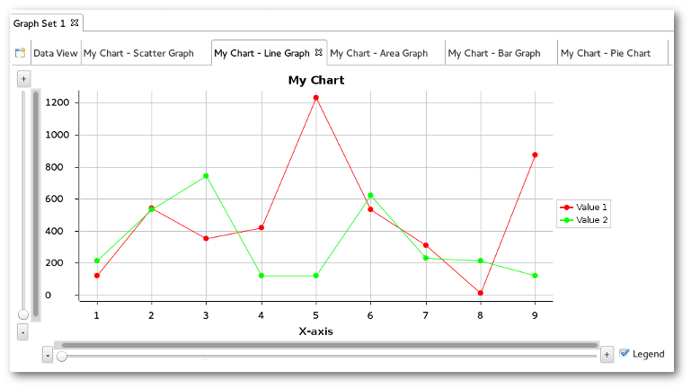

#### Area Graph

The Area Graph is traditionally ideal for horizontally depicting non-cumulative data over, say, time. All values must be numeric.

#### Bar Graph

The Bar Graph typically uses bars to show frequencies or values. Labels can be given to bars by applying string values to the x-axis. Y-axis values, though, must be numeric.

#### Pie Graph

The Pie Graph uses a pie to show percentages. One pie is drawn for each data series provided. Titles can be given to slices by applying string values to the x-axis. Y-axis values, though, must be numeric.

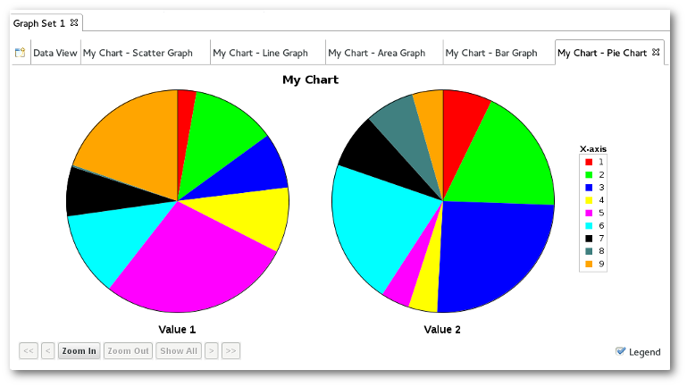

### Filters

Filters are screens that you can set on your Data Table to limit the quantity of samples you wish to work with. Filters are very often used in restricting the sheer amount of information available to make data tables and graphs more substantial and manageable.

The following options exist to work with Filters in the Data Table:

-   **Add Filter...** - Adds a Filter to the Data Table. Multiple filters may be applied at a time.
-   **Remove Filter...** - Removes a Filter from the Data Table. All currently applied filters will be listed in a drop-down menu; the user may select which of them to remove.

When you select **Add Filter** you see the following dialogue box:

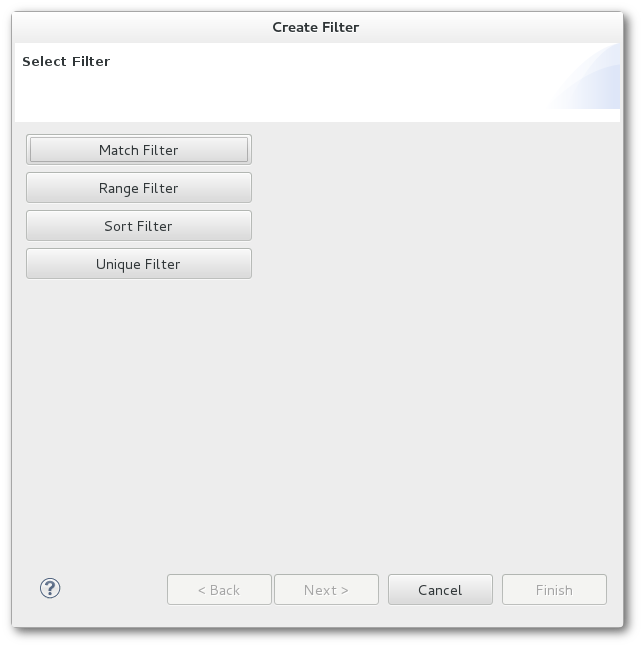

What follows is a breakdown of each Filter type, and an example of how each affects this sample data set:

-   **Match Filter** - This filter either removes or keeps everything from the data set where the selected selected column's value matches the chosen value.

Result:

-   **Range Filter** - This filter keeps everything from the data set that is either inside or outside the selected range of values. Note that it is possible to use unbounded ranges by leaving either the lower or upper bound blank.

Result:

-   **Sort Filter** - This filter will sort the data set based on the selected column. No data will be

removed.

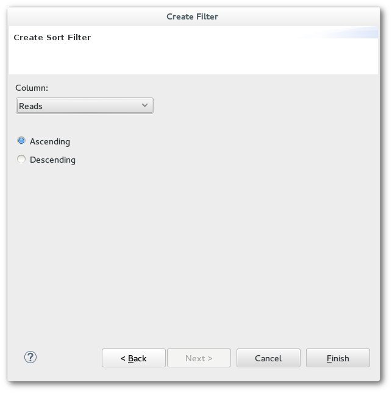

Result:

-   **Unique Filter** - This filter will remove all merge all entries in that data set that share a common

value in the selected column. Data for the removed rows will be aggregated together based on the chosen aggregation method.

-   -   **Average Aggregate** - This aggregate will return the average of all the items consolidated.
    -   **Count Aggregate** - This aggregate will return the number of items consolidated.
    -   **Max Aggregate** - This aggregate will return the maximum value of all the items consolidated.
    -   **Min Aggregate** - This aggregate will return the minimum value of all the items consolidated.
    -   **Sum Aggregate** - This aggregate will return the sum of all the items consolidated.

### Graph Interaction

#### Graph Options

Each of the [ Graph Types](#data-graph-types "wikilink") have similar options that can be used in the Graph Selector View:

-   **Legend** - This option turns on and off the legend, particularly useful in the graph types that show multiple series.
-   **Graph Scrolling/Scaling** - It is possible to zoom & scroll through any graph axis. Different controls are provided for navigating through continuous and discrete axes.

To zoom in/out of a continuous axis (ie Scatter/Line/Area Graph), use the +/- buttons or the Scale bar beneath / to the left of a graph. To scroll through the viewing area, use the horizontal/vertical scroll bars provided.

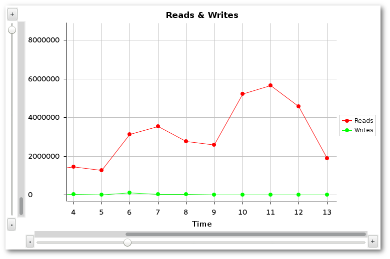

Specialized controls are available for zooming & scrolling through discrete axis, namely the bars of a Bar Graph or the pies of a Pie Chart.

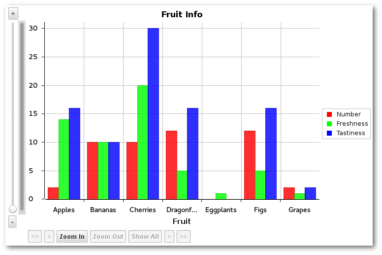

Zooming is performed with the **Zoom In/Out** buttons beneath the graph. To scroll to left or right, click **\<** or **\>** respectively. To jump to the beginning or end of the axis, click **\<\<** or **\>\>** respectively.

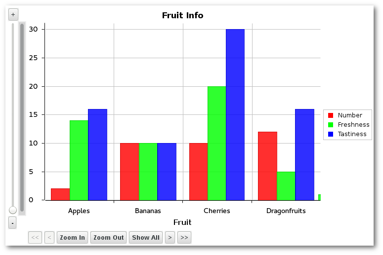

Use [ Preferences](#preferences "wikilink") to configure other graph settings, such as grid lines and viewable data items.

#### Graph Coordinate Tooltips

Hover over any data point on a graph to display detailed information about that point's coordinates. This feature is available for all graph types.

Graphing Tasks
--------------

### Importing/Exporting Data Sets

A data set is comprised of the contents of a Graph Set's data table. From time to time the user may want to preserve this data for continued work at a later date/time or to share findings with others. The Importing and Exporting options provide an easy way to do this.

To save a data set, click the **Export Data Set** toolbar button while viewing one of the tabs of the Graph Set data that is to be saved (either the Data Table or one of its graphs). To load & display a previously-exported data set, use the **Import Data Set** toolbar button, which is available at all times.

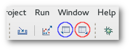 *The Data Set toolbar buttons that appear while viewing a Graph Set. (Blue/left: Export. Red/Right: Import.)*

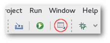 *The Import Data Set button as it appears while a Graph Set is not being viewed.*

In either case, a file dialog will appear to allow the user to choose the path on the filesystem where the data set should be exported to / imported from.

### Saving a Graph Image

It is possible to save graphs as image files. To do so, view the graph that is to be saved and click the **Save Graph** button that appears in the toolbar. This opens a dialogue box where the user can navigate to the location they desire to save the image file.

Reference
---------

### Frequently Asked Questions

This section details frequently asked questions relating to graphing script output.

**Can I make more than one graph at one time? Do they update concurrently?**

A: Yes and yes. In the Run Configuration of the script you want to create plots of, you can create multiple graphs at once. Also, after a graph-enabled script is run, you may create several additional graphs by clicking the Graph Wizard button in the Graph Selector View.

**Can I increase the rate at which graphs are updated?**

A: Yes. By default it is set to once per second, but you can increase this in [ Preferences](#preferences "wikilink").

**Is there any way to save or export the graph images?**

A: Yes. A **Save Graph** button appears in the toolbar whenever you are viewing a graph. Clicking it will allow you to save the graph currently in focus.

**What if I want to preserve this data for manipulation later?**

A: While viewing a Data Table or one of the graphs it provides data to, the **Export Data Set** toolbar button is available. Click this button to save the focused Data Table's contents into a .set file. Such files can be loaded back later with the **Import Data Set** button on the toolbar (which is always available).

Copyright Information
=====================

© Copyright IBM Corporation 2012
© Copyright Red Hat, Inc. 2009
© Copyright Phil Muldoon <pkmuldoon@picobot.org> 2006.
This documentation is licensed under the Eclipse Public License v. 1.0.
