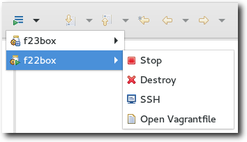
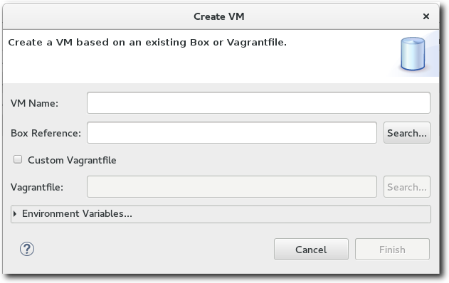

Introduction
============

The Linux Tools Vagrant Tooling plug-ins allow a user to manage Vagrant Boxes, and Virtual Machines as one might do with the 'vagrant' commandline tool.

For details on Vagrant, see <https://www.vagrantup.com/>

Vagrant Toolbar Menu
====================

Sometimes, it might be desired to perform some common actions through Vagrant without having to switch perspectives. For these tasks, the Vagrant Tooling also contributes a workbench toolbar icon with a dropdown menu. This displays the set of known VMs, their state, and actions that are possible from that context.

Vagrant Tooling Perspective
===========================

A new perspective known as the Vagrant Tooling Perspective is added.

Vagrant Box View
----------------

### Overview

The Vagrant Box view is used to manage the set of existing Box files of which Vagrant is aware.

The following actions are possible from this view depending on the context :

-    - [Add Vagrant Box](#adding-a-vagrant-box "wikilink")
-    - [Create VM](#creating-a-virtual-machine "wikilink")
-    - Remove one or more boxes
-    - Refresh list of boxes

### Adding a Vagrant Box

To add a Vagrant Box, simply click the "Add Box" icon. Provide a name for the box, and then specify either the system path, url, or Atlas repository for the Box file.

### Creating a Virtual Machine

One can create a virtual machine in 2 different ways :

-   Using an existing Vagrant Box file
-   Using an existing Vagrantfile

In either case, we selected the "Create VM" button, and assign some name to our virtual machine. If a Box was imported into the Vagrant Box View, we can use it to define our virtual machine. We can even specify a Box file on the local system that hasn't been imported. If on the other hand we have a Vagrantfile, we can simply select "Custom Vagrantfile" and provide the location of this file on our system.

We can optionally provide environment variables to be passed to the creation of this virtual machine.

Vagrant VM View
---------------

### Overview

The Vagrant VM view is used to manage the set of existing virtual machines managed by Vagrant.

The following actions are possible from this view depending on the context :

-    - Start a stopped VM
-    - Stop a running VM
-    - Delete a VM
-    - [SSH into VM](#sshing-into-a-virtual-machine "wikilink")
-    - Refresh VM list

### SSHing into a Virtual Machine

If a Virtual Machine is configured with a proper SSH daemon, one can connect to it with the click of a button.

