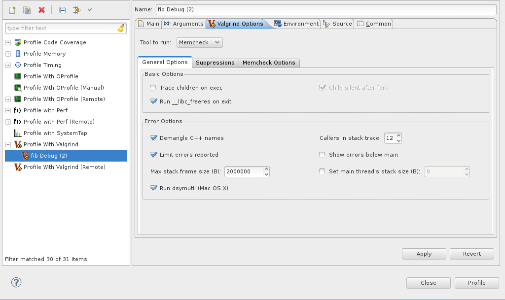
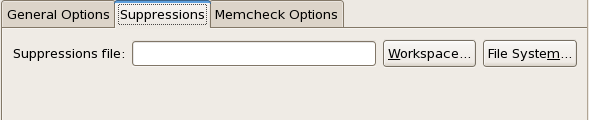
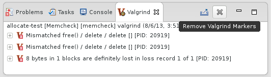
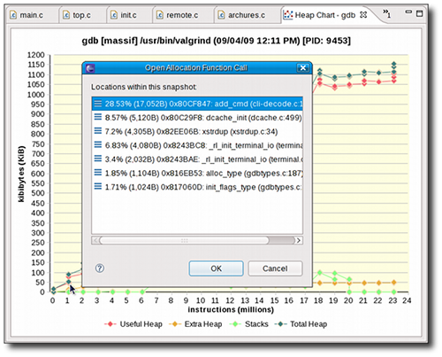
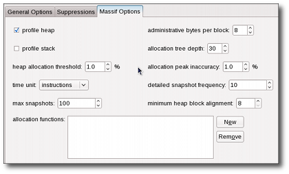
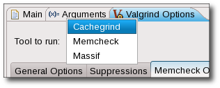
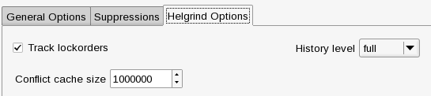

Overview
========

**Valgrind** is an instrumentation framework for building dynamic analysis tools that can be used to profile applications in detail. Valgrind tools are generally used to automatically detect many memory management and threading problems. The Valgrind suite also includes tools that allow you to build new profiling tools to suit your needs.

The Valgrind plug-in for Eclipse (documented herein) integrates several Valgrind tools into Eclipse. This allows Eclipse users to seamlessly include profiling capabilities into their workflow. At present, the Valgrind plug-in for Eclipse supports four Valgrind tools: [Memcheck](#using-memcheck "wikilink"), [Massif](#using-massif "wikilink"), [Cachegrind](#using-cachegrind "wikilink") and [Helgrind](#using-helgrind "wikilink").

For more information about Valgrind, refer to <http://www.valgrind.org/>.

Installing
==========

In order for the Valgrind plug-in for Eclipse to work properly, you should have the *valgrind-3.3.0* (or later) package installed on your system first.

Once the *valgrind* package is installed, the easiest way to install the Valgrind plug-in for Eclipse is through the ***Software Updates and Add-ons*** menu.

General Usage
=============

You can use the Valgrind plug-in's "one-click launch" shortcut to run a default profile. Doing so is similar to running `valgrind ./<i>program_name</i>` from the command line. To use the one-click launch shortcut, right-click on the *project* or *binary* name in the ***Project Explorer*** window and navigate to <u>Profiling Tools</u> \> <u>Profile With Valgrind</u>. If a source file belonging to that program is available on any open editor, you can also right-click inside the editor to navigate to the one-click launch.

Configuring a Profile Run
-------------------------

To configure a Valgrind profile run, navigate to <u>Profiling Tools</u> \> <u>Profile Configurations</u> to access the ***Profile Configurations*** menu.

The ***Profile Configurations*** menu allows you to configure a profile run with some basic Valgrind profiling options, along with the most useful options for each Valgrind tool. These settings can be configured in the ***Valgrind Options*** tab of a specific profile run.

### General Options

The ***General Options*** tab allows you to configure the following options:

-   ***Tool to run*** allows you to choose between [Memcheck](#using-memcheck "wikilink"), [Massif](#using-massif "wikilink"), and [Cachegrind](#using-cachegrind "wikilink") in your profile run. By default, using the one-click shortcut will run the [Memcheck](#using-memcheck "wikilink") tool.
-   ***Trace children on exec*** configures whether or not to trace into sub-processes initiated via the `exec` system call. This is identical to using the `--trace-children=` option. This is disabled by default.
    For more details on the use of the ***Trace children on exec*** option for each Valgrind tool, refer to [Profiling Child Processes](#profile-child-processes "wikilink").
-   ***Run \_\_libc\_freeres on exit*** configures whether or not to run a `__libc_freeres` routine after the profile run exits. This routine instructs `glibc` to release all memory it has allocated, and is similar to using the `--run-libc-freeres=` option. This is enabled by default.
-   ***Child silent after fork*** is enabled by default, and in most cases cannot be configured. This option disables any debugging or logging output from child processes created from a `fork` call.
-   ***Demangle C++ names*** allows Valgrind to translate encoded C++ names ("mangled" by `g++` during compilation) back to something similar to their original form. This is enabled by default.
-   ***Limit errors reported*** instructs Valgrind to stop reporting errors after a total of 10,000,000 actual errors or 1,000 unique errors have been detected. This is enabled by default.
-   ***Callers in stack trace*** configures how many levels of function call names Valgrind should use to identify program locations. By default, Valgrind uses 12 levels.
-   ***Show errors below main*** configures stack traces for errors should show any functions that appear beneath `main()`. This is disabled by default.
-   ***Max stack frame size*** is the maximum size of a stack frame, and is set to 2000000 by default.

For more information about these options, refer to `man valgrind`.

### Suppressions

You can also configure your profile run to use a suppressions file (similar to the `--suppressions=` option. To do this, click the ***Suppressions*** tab.

The <u>Workspace</u> button allows you to select a resource from the workspace as your suppressions file. To use a suppressions file outisde of the workspace, use the <u>File System</u> button.

Exporting Valgrind Data
-----------------------

To export the raw data collected during a Valgrind profile run, use the ***Export*** wizard menu. To access the ***Export*** wizard menu, navigate to <u>File</u> \> <u>Export</u> and select <u>Valgrind Log Files</u> under the category <u>Other</u>.

Alternatively, you can also use the <u>Export Valgrind Log Files</u> icon (  ) on the Valgrind view toolbar to access the ***Export*** wizard menu.

Error Markers
-------------

The Valgrind Eclipse plug-in uses error markers to identify specific errors, found by the underlying Valgrind tool, to the user. The sub-tools that make use of these markers are Memcheck and Helgrind; each emitting specific memory or concurrency error.

In post 2.1 releases of Linux Tools, it is possible to clear these error markers by simply re-building or cleaning the respective project. For the older versions the ***Remove Markers*** toolbar action is available to manually clear the markers.

Other Operating Systems
-----------------------

The Valgrind Eclipse plugins were designed and tested on Linux systems only. However, the Valgrind tools are also available on Mac OS X and so too are the Linux Tools Eclipse Valgrind plugins. The plugins are not officially supported on Mac OS X, but here are instructions to get it working.

### Mac OS X 10.6

As of Apr 19, 2010 the official release of the Valgrind tool does not work on 10.6. However, there are patches available to make it work.

Brief instructions to compile the Valgrind tool is here: <http://code.google.com/p/data-race-test/wiki/ValgrindOnSnowLeopard>

Essentially, you need to run the following script. (Ensure you have wget installed)

` svn co -r 11104 `[`svn://svn.valgrind.org/valgrind/trunk`](svn://svn.valgrind.org/valgrind/trunk)` valgrind`
` cd valgrind`
` wget `[`http://bugs.kde.org/attachment.cgi?id=40091`](http://bugs.kde.org/attachment.cgi?id=40091)` -O snow-leopard.patch`
` wget `[`http://bugsfiles.kde.org/attachment.cgi?id=40900`](http://bugsfiles.kde.org/attachment.cgi?id=40900)` -O arc4random.patch`
` wget `[`http://bugsfiles.kde.org/attachment.cgi?id=42530`](http://bugsfiles.kde.org/attachment.cgi?id=42530)` -O sidt.patch `
` wget `[`http://bugsfiles.kde.org/attachment.cgi?id=42892`](http://bugsfiles.kde.org/attachment.cgi?id=42892)` -O signal.patch`
` patch -p0 < snow-leopard.patch`
` patch -p0 < arc4random.patch`
` patch -p1 < signal.patch`
` cd VEX; patch -p0 < ../sidt.patch ; cd ..`
` touch darwin10-drd.supp`
` touch darwin10.supp`
` ./autogen.sh || autoreconf -fvi`
``  ./configure --prefix=`pwd`/inst ``
` make -j 8 && make install`

Once this is done, see instructions below for other Mac OS's

### x86\_64 Mac OS

Valgrind is only compatible with x86 binaries on Mac OS, so if you have x86\_64 you'll need to ensure that x86 binaries are being built. To do this, right click on the project and select Properties.

Within the Properties window, select C/C++ Build then add '-m32' to the Command field for the MacOS X C++ Linker, GCC C++ Compiler and GCC C Compiler. This will cause x86 binaries to be created.

### All Mac OS

First ensure you have a release of the Valgrind command-line tool installed. See <http://valgrind.org/> and see above for special Valgrind instructions. After installing, you will need to create a symlink to /usr/bin/valgrind so the Valgrind plugin can find it.

Use `which valgrind` to find the install location of the Valgrind binary.

`ln -s /usr/bin/valgrind /location/of/valgrind` will create the symlink.

After that, the Eclipse Valgrind plugin should work as specified in other parts of this wiki page.

Using Memcheck
==============

Memcheck is the default tool used by Valgrind and the Valgrind plug-in for Eclipse. It allows you to detect memory-related problems such as memory leaks, use of uninitialized memory, and reads from/writes to inappropriate stack areas. For more information about Memcheck, refer to <http://www.valgrind.org/docs/manual/mc-manual.html>.

Analyzing Memcheck Profile Results
----------------------------------

Any memory management errors detected by Memcheck are displayed in the Valgrind view, which appears automatically after a profile run. Each displayed error can be expanded in the Valgrind view to display its stack trace.

In some cases, Memcheck can determine which section of the source code causes a reported error. Whenever this is the case, double-clicking on the stack trace of the reported error will open the related source file and place the insertion point on the line responsible for the error.

Configuring a Memcheck Profile Run
----------------------------------

To configure a Memcheck profile run, navigate to <u>Profiling Tools</u> \> <u>Profile Configurations</u> to access the ***Profile Configurations*** menu. In the ***Valgrind Options*** tab, navigate further to ***Memcheck Options***.

The ***Memcheck Options*** tab allows you to configure the following Memcheck options:

-   ***check for memory leaks*** corresponds to the Memcheck command-line option `--leak-check=` option with only the values "yes" or "no" supported. When enabled, Memcheck will search for memory leaks when the client program finishes and will show each individual leak based on the settings of ***show reachable blocks*** and ***show possibly lost blocks***.

-   ***leak resolution*** corresponds to the Memcheck command-line option `--leak-resolution=` and sets how tolerant Memcheck should be in considering different stack traces to be the same. The default setting is "low", which means only the first two entries need to match. The "med" setting requires four entries to declare a match. The "high" setting requires all entries to declare match.

-   ***freelist size (blocks)*** corresponds to the Memcheck command-line option `--freelist-vol=`, which specifies the maximum total size (in bytes) of memory blocks to be marked "inaccessible" once they have been freed using `free` (as in C) or `delete` (as in C++). The default value for ***freelist size (blocks)*** is 10000000.

-   ***minimum heap block alignment*** corresponds to the Memcheck command-line option `--alignment=`, which specifies the minimum alignment/size of heap blocks. The default value for this option is 8.

-   ***show reachable blocks*** corresponds to the Memcheck command-line option `--show-reachable` and configures whether or not Memcheck should report all types of leaks (option true) or only show definitely lost / possibly lost blocks (option false) based on the value of ***show possibly lost blocks***. The default value of this option is false.

-   ***show possibly lost blocks*** corresponds to the Memcheck command-line option `--show-possibly-lost` and configures whether Memcheck should report 'possibly lost blocks' in addition to 'definitely lost blocks' if ***show reachable blocks*** is set to false. If ***show reachable blocks*** is true, then this setting is ignored as all leak block types are reported. The default value of this option is true.

-   ***undef value errors*** corresponds to the Memcheck command-line option `--undef-value-errors` and specifies whether or not Memcheck should detect dangerous uses of undefined value errors. This is enabled by default.

-   ***track origins*** corresponds to the Memcheck command-line option `--track-origins=` which specifies whether Memcheck tracks the origin of uninitialized values or not. By default, Memcheck does not track uninitialized values.

-   ***allow partial loads*** corresponds to the Memcheck command-line option `--partial-loads-ok=`, which controls how Memcheck handles word-sized, word-aligned loads from addresses from which bytes are addressable and others are not. This is disabled by default (i.e. treat loads from partially invalid and completely invalid addresses as the same).

-   ***gcc 2.96 workarounds*** corresponds to the Memcheck command-line option `--workaround-gcc296-bugs`, which controls whether Memcheck should assume that small reads/writes below the stack pointer are due to bugs in *gcc-2.96*. This option is disabled by default (i.e. do not assume them to be reslting from *gcc-2.96* bugs; report such reads/writes as errors).

-   ***fill free'd areas*** corresponds to the Memcheck command-line option `--freefill=`. A hex byte is specified that is used by Memcheck to fill blocks freed by free, delete. This can be used to determine obscure memory corruption problems.

-   ***fill malloc'd areas*** corresponds to the Memcheck command-line option `--mallocfill=`. A hex byte is specified that is used by Memcheck to fill blocks allocated by malloc, new, etc, but not by calloc. This can be used to determine obscure memory corruption problems.

-   ***ignore ranges*** corresponds to the Memcheck command-line option `--ignore-ranges=`. Any ranges listed in this option will be ignored by Memcheck's addressability checking.

Refer to <http://www.valgrind.org/docs/manual/mc-manual.html#mc-manual.suppfiles> for information about Memcheck suppression files. For more information about each Memcheck option in the Valgrind plug-in for Eclipse, refer to `man valgrind`.

Using Massif
============

Massif is a Valgrind tool that measures how much heap memory an application uses. Heap memory profiling is useful in determining how to reduce the memory usage of an application. For more information about Massif, refer to <http://www.valgrind.org/docs/manual/ms-manual.html>.

To use Massif, navigate to <u>Profiling Tools</u> \> <u>Profile Configurations</u> to access the ***Profile Configurations*** menu. Open the ***Valgrind Options*** tab and choose Massif from the <u>Tool to run:</u> drop-down list.

Analyzing Massif Profile Results
--------------------------------

Massif distills a large volume of data. The Valgrind plug-in for Eclipse presents three ways to view this data:

-   **Snapshots Table**. Each entry in the Valgrind view contains useful information about each snapshot taken by Massif during the profile run. The peak snapshot is highlighed in bold text.

    

-   **Heap Tree**. Detailed snapshots are denoted by the <u>Show Heap Tree</u> icon (  ). Double-clicking any of these snapshots will modify the Valgrind view to display all detailed snapshots. Collapsing each detailed snapshot in this view will display a heirarchy of function calls (i.e. heap tree) detailing the heap allocations used during the snapshot.

    

    Some functions within the heap tree list a related source file. Double-clicking these functions will open the listed source file and place the insertion point on the specific function responsible for the call.
    You also can also toggle the <u>Show Heap Tree</u> shortcut on the Valgrind view toolbar to switch between **Snapshots Table** and **Heap Tree** views.

-   **Heap Chart**. The information in the snapshots table is also available in line chart form, displayed in the **Heap Chart** window. Clicking any data point in the chart will highlight its corresponding snapshot in the snapshot table. Double-clicking on a data point that corresponds to a detailed snapshot will open an editor to one of its function calls.

    

    If a detailed snapshot contains calls to multiple source files (or multiple functions within a source file), double-clicking its corresponding data point on the heap chart will open the ***Open Allocation Function Call*** menu. Double-clicking a function from the ***Open Allocation Function Call*** menu will open its corresponding source file and place the insertion point on the specific function responsible for the call.

Configuring a Massif Profile Run
--------------------------------

To configure a Massif profile run, navigate to <u>Profiling Tools</u> \> <u>Profile Configurations</u> to access the ***Profile Configurations*** menu. In the ***Valgrind Options*** tab, navigate further to ***Massif Options***.

The ***Massif Options*** tab allows you to configure the following Massif options:

-   ***profile heap*** specifies whether or not heap profiling should be performed. This option is enabled by default.

-   ***profile stack*** specifies whether or not stack profiling should be performed. This option is disabled by default, as it significantly slows down Massif.

-   ***heap allocation threshold*** specifies the significance threshold for heap allocations (as a percentage). Allocation tree entries that account for less than this will be aggregated. The default value for this option is 1%.

-   ***time unit*** specifies what time unit should be used for the profile. The possible values for this are instructions (default), milliseconds, or bytes.

-   ***max snapshots*** specifies the maximum number of snapshots that the profile should take. The default value for this is 100.

-   The ***allocated functions*** field is identical to the Massif command-line option `--alloc-fn=`, which allows you to specify any function to be treated as a heap allocation function. To add or remove functions to this field, use the <u>New</u> or <u>Remove</u> buttons. You can specify multiple functions in this field.

-   ***administrative bytes per block*** is identical to the Massif command-line option `--heap-admin=`, which specifies the number of administrative bytes (per block) to use if heap profiling is enabled. The default value for this option is 8.

-   ***allocation tree depth*** is identical to the Massif command-line option `--depth=`, which specifies the maximum depth of the allocation trees recorded for detailed snapshots. The default value for this option is 30.

-   ***allocation peak inaccuracy*** is identical to the Massif command-line option `--peak-inaccuracy=`. Massif records a peak only when the global memory allocation size exceeds the previous peak by the specified percentage value of this option. The default value for this option is 1.

-   ***detailed snapshot frequency*** specifies the frequency at which Massif should take detailed snapshots. The default value for this option is 10; to specify that each snapshot should be detailed, set this option to 1.

-   ***minimum heap block alignment*** specifies the minimum alignment (i.e. size) of heap blocks.

For more information about each Massif option in the Valgrind plug-in for Eclipse, refer to `man valgrind`.

Using Cachegrind
================

Cachegrind performs cache and branching profiling. A Cachegrind profile run measures the number of cache misses and branch mispredictions performed by an application. Cachegrind collects the following statistics:

-   L1 instruction cache reads and misses
-   L1 data cache reads and read misses, writes, and write misses
-   L2 unified cache reads and read misses, writes and write misses
-   Conditional branches and mispredicted conditional branches
-   Indirect branches and mispredicted indirect brances

To use Cachegrind, navigate to <u>Profiling Tools</u> \> <u>Profile Configurations</u> to access the ***Profile Configurations*** menu. Open the ***Valgrind Options*** tab and choose Cachegrind from the ***Tool to run:*** drop-down list.

Analyzing Cachegrind Profile Results
------------------------------------

The results of a Cachegrind profile run are displayed in the Valgrind view. These results show Cachegrind's cache/branch data in different levels of granularity. Double-clicking on any file, function, or line will open the corresponding source file and place the cursor on the appropriate location (if the source can be resolved).

Configuring a Cachegrind Profile Run
------------------------------------

To configure a Massif profile run, navigate to <u>Profiling Tools</u> \> <u>Profile Configurations</u> to access the ***Profile Configurations*** menu. In the ***Valgrind Options*** tab, navigate further to ***Cachegrind Options***.

The ***Cachegrind Options*** tab allows you to configure the following Cachegrind options:

-   ***Profile Cache Accesses/Misses*** is identical to the Cachegrind command-line option `--cache-sim=`, which specifies whether or not to collect cache accesses and miss counts. This option is enabled by default.

-   ***Profile Branch Instructions/Mispredictions*** is identical to the Cachegrind command-line option `--branch-sim=`, wich specifies whether or not to collect branch instruction and misprediction counts. This option is disabled by default.

-   The options inside the <u>Manually Set Cache Specifications</u> box allow you to configure the size, associativity, and line size of the following caches:
    -   **l1** (level 1 instruction) cache
    -   **D1** (level 1 data) cache
    -   **L2** (level 2) cache

For more information about each Cachegrind option in the Valgrind plug-in for Eclipse, refer to `man valgrind`.

Using Helgrind
==============

Helgrind is a tool that allows you to detect synchronisation errors in C, C++ and Fortran programs that use POSIX pthreads. For more information about Helgrind, refer to <http://valgrind.org/docs/manual/hg-manual.html>.

Analyzing Helgrind Profile Results
----------------------------------

All the synchronization errors found by Helgrind are displayed in the Valgrind view, which appears automatically after a profile run. Each displayed error can be expanded in the Valgrind view to display its stack trace.

In some cases, Helgrind can determine which section of the source code causes a reported error. Whenever this is the case, double-clicking on the stack trace of the reported error will open the related source file and place the cursor on the line responsible for the error. This stack trace view is similar to the view that the Memcheck plug-in provides.

Configuring a Helgrind Profile Run
----------------------------------

To configure a Helgrind profile run, navigate to <u>Profiling Tools</u> \> <u>Profile Configurations</u> to access the ***Profile Configurations*** menu. In the ***Valgrind Options*** tab, navigate further to ***Helgrind Options***.

The ***Helgrind Options*** tab allows you to configure the following options:

-   ***track lockorders*** : when enabled, allows Helgrind to perform lock order consistency checking.

-   ***history level*** defines how much information Helgrind will collect about earlier conflict accesses which can cause data races. This setting has three possible values - full, none and approx - where "full" means that Helgrind will collect and store any possible data, which is expensive in memory and speed; "none" means that no information about previous accesses will be collected; "approx" is a compromise between these two previous settings.

-   ***conflict cache size*** is a setting which only has an effect with history-level=full. It controls the size of the memory cache used by Helgrind to store previous conflicting accesses. Increasing the value by 1 means increasing Helgrind's memory requirement by 100 bytes.

For more information about each Helgrind option in the Valgrind plug-in for Eclipse, refer to man valgrind, section "HELGRIND OPTIONS".

Remote Valgrind
===============

You can profile remote projects just as local ones. This can be useful when developing an application for a different architecture.

To run Valgrind remotely, right-click a remote c/c++ project and navigate to "Profiling Tools", then "Profile Configurations". In the new window, double-click the Profile with Valgrind (remote) profile configuration.

In the main tab, click "Browse" under "C/C++ executable" to choose the binary that will be executed. The same tool configurations for local projects apply to remote ones.

After configuring the profile, click the Profile button to launch the profile. Results will be displayed in the same Valgrind view previously described.

Special Cases
=============

Encountering Errors
-------------------

If the profiled application contains any errors or if any Valgrind options you selected result in an error, these errors will be reported in the *Core Messages* pane of the Valgrind View. The Memcheck tool outputs all of its profile results on this pane.

For other tools, it is possible to switch between the Core Messages pane and the tool's output in the Valgrind view menu.

Profiling Child Processes
-------------------------

To profile child processes during a profile run, enable the ***Trace children on exec*** option in the ***General Options*** tab (of the ***Valgrind Options*** tab). Memcheck's results will list the process ID (PID) for each reported error in the Valgrind view.

Massif, on the other hand, will present each process separately and allow you to switch between processes with the <u>Select Process ID</u> dropdown icon ( <image src="images/Thread.gif"> ) in the Valgrind view toolbar.

Cachegrind will report each PID separately as a top-level element in its output tree.
